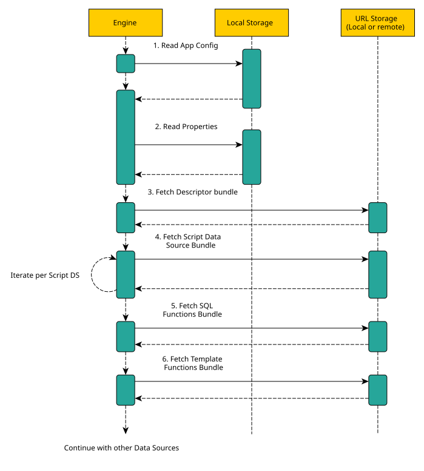
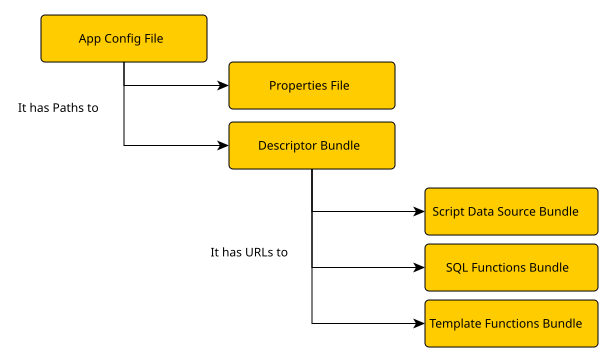

import { Callout } from 'nextra/components'
import Tag from '../../component/Tag'

# Artifacts

Kubling loads its runtime definition from an application configuration and a
set of Modules. Together, these artifacts define how Kubling starts, which
Virtual Databases it exposes and which extensions each VDB uses.

## Initialization process

1. The `APP_CONFIG` environment variable identifies the application
   configuration.
2. The application configuration selects the descriptor Module.
3. The descriptor Module declares the Virtual Databases and references the
   other Modules they require.
4. Kubling resolves those references and loads the artifacts before making the
   configured VDBs available.

<Callout>
  The application configuration is the only artifact in this chain that is not
  a Module. Build Modules with the [Kubling CLI](/cli/modules) instead of
  assembling their internal format directly, and give each Module an immutable
  version and release lifecycle.
</Callout>

## Runtime artifacts

### Application configuration

A YAML document containing top-level runtime options and the origin of the
descriptor Module.

[See the application configuration schema.](/schemas#main-application-configuration)

### Descriptor Module

Declares the Virtual Databases and locates their configuration, endpoint
descriptors and referenced Modules. Its Module manifest inventories those
contents.

[See the descriptor Module schema.](/schemas#descriptor-bundle-information-file-bundle-infoyaml)

Each listed VDB has its own
[Virtual Database configuration](/schemas#virtual-database-information-file-located-inside-the-descriptor-bundle).

### JavaScript data source Module

Contains the definition, scripts and resources required by a JavaScript data
source.

[See the JavaScript Module schema.](/schemas#script-module-bundle-information-file-bundle-script-infoyaml)

### SQL Functions Module

Contains function metadata and scripts added to the Kubling SQL function
catalog.

[See how to create SQL functions.](/modules/functions/sql)

### Template Functions Module

Contains function metadata and scripts added to the Kubling template function
catalog.

[See how to create template functions.](/modules/functions/template)

### Semantic Module <Tag description={"v26.5+"} />

Contains the manifest and semantic documents used to add a domain model to a
VDB. Semantic federation is a Preview feature.

[See how to build and configure semantic Modules.](/semantics/modules)

## Artifact dependencies

Artifact references form a dependency graph. The application configuration
selects the descriptor Module, and the descriptor Module identifies the VDB
configuration and additional Modules that Kubling must resolve.

