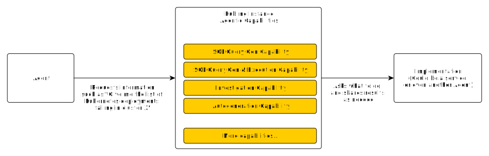

import Tag from '../../component/Tag'

# Kubling as an Agent <Tag description={"v25.2+"} /> <Tag bgColor={"bg-kubling-dark-violet"} txtColor={"text-white"} description={"PREVIEW"} txtFont={"font-gilroyBold"} />

As we move toward an AI-driven, agentic economy, we at Kubling believe that one of the most foundational elements will be **data access**.

Agents—like any other user—require access to data, whether operational or analytical. However, due to the non-deterministic nature of most LLM-based solutions, enabling agents to query and mutate data remains a sensitive issue for many organizations.

We also believe that no single AI agent solution should dominate the landscape. Instead, we advocate for a **cooperative and composable** approach to designing robust agentic systems.

## Supporting Other Agents

Kubling’s agentic capabilities are designed primarily to support **other agents**, rather than direct interaction with end users.

For example, imagine a scenario where a master agent interfaces with end users and delegates specific tasks to specialized agents. If a user asks for “the list of Kubernetes deployments failing in cluster X,” the master agent doesn't need to handle that query directly. Instead, it can rely on an upstream agent—such as a Kubling instance—specialized in operational data, to provide the answer.

## Open Protocol & Contract

The Kubling engine does not contain built-in logic to act as an agent itself. Instead, it relies on upstream services that provide the specific functionalities it requires.

These services are fully configurable—each capability supported by the Kubling engine corresponds to a counterpart system responsible for implementing that functionality.

The only requirement for these upstream services is adherence to a shared protocol for exchanging information with Kubling instances, which is detailed in this section.

### Why Is Having an Open Protocol Crucial?

There are several key reasons why we designed Kubling around an open protocol:

1. Some capabilities—such as `investigation`—require iterative loops, where the Kubling instance needs to share intermediate query results. Since Kubling may handle sensitive data, many organizations prefer to implement their own solutions to ensure no third-party services gain access to private information.

2. The fields of LLMs and agents are evolving rapidly, with new tools and frameworks emerging every day. An open protocol empowers users to choose how they want to implement or integrate these evolving technologies, without being locked into a specific vendor or architecture.

## Kubling Agent Platform (Our Implementation)

Implementing services that handle specific capabilities can require a significant investment of time and resources. To help you get started quickly—and to provide a reference implementation—we’ve built our own service: the **Kubling Agent Platform**.

You can use it out of the box or as inspiration for building your own solution.

For more details, refer to the dedicated entry in this section.
