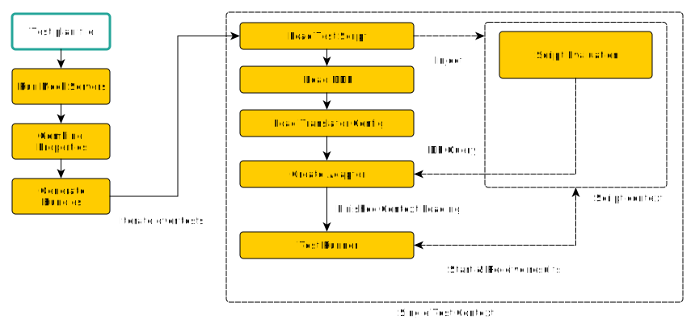

import { Callout } from 'nextra/components'

# Test Framework
The CLI includes a command designed to assist with the creation of integration tests.

Before proceeding, it is important to recognize that Kubling modules, like any other project, 
should be tested following the established testing standards: unit tests, integration tests, and functional tests.

- **Unit tests** are conducted locally using pure Scripting code, like JavaScript in the case of a data source of `SCRIPT_DOCUMENT_JS`.
- **Functional tests** can be executed using containers. This is typically done within a build pipeline that compiles all modules and runs a 
local full-server container (you can use the free CE version). 
During these tests, a client performs operations and verifies the results. 
Remember that the application configuration and properties should point to mock servers or the upstream systems you use for testing.

However, **integration tests** present a unique challenge. 

The goal is to determine whether a query executes successfully by analyzing results such as rows, columns, or update counts 
for operations like `INSERT`, `UPDATE`, or `DELETE`, without needing to spin up the entire server in a container. 
This makes the process lighter, as there is no need for components such as initializers, RBAC, or the scheduler.

To address this need, the `kdv` CLI offers a `test` command with a subcommand called `integration`. 
This subcommand reads a manifest file and runs a streamlined workflow to set up the necessary context and execute your integration test JavaScript files.

Additionally, the `integration` subcommand can launch one or more mock servers using the same approach described above. 
In fact, it starts embedded servers for the testing process.

## Virtual Database and Data Sources initialization
Integration test does not work like the Kubling engine, that is, the way VDB and Data Sources are initialized differ.

In the engine, the initialization process follows an order given by configuration files, [which was explained here](/Concepts/artifacts#initialization-process), however,
and in order to make the integration test as light as possible, each individual test is loaded directly into the DQP, without passing through the engine configuration machinery.

Therefore, **the descriptor's Virtual Database configuration files are not loaded** as such, but only their components individually.

### Test initialization process

The following diagram depicts how the test initialization process works and what are the roles of each part of the integration test configuration:



## Test Plan
The integration test command needs a test plan to execute.

<details>
<summary>The plan is a yaml file whose schemas is as follows:</summary>
```yaml
type: "object"
id: "schema:kubling:dbvirt:cli:model:test:IntegrationTestPlan"
properties:
  descriptorModule:
    type: "object"
    id: "schema:kubling:dbvirt:cli:model:test:ModuleDescriptor"
    description: "Descriptor module information."
    properties:
      directory:
        type: "string"
        description: "Root directory of the module code."
      build:
        type: "boolean"
        description: "Indicates whether the module must be built before the integration\
          \ tests start."
      parse:
        type: "boolean"
        description: "Indicates whether the module's code must be parsed before building."
      bundleFilePath:
        type: "string"
        description: "Path to the module bundle."
  mainModule:
    type: "object"
    $ref: "schema:kubling:dbvirt:cli:model:test:ModuleDescriptor"
    description: "Main module is a module data source required in tests."
  templateFunctionsModule:
    type: "object"
    $ref: "schema:kubling:dbvirt:cli:model:test:ModuleDescriptor"
    description: "Template functions module information."
  sqlFunctionsModule:
    type: "object"
    $ref: "schema:kubling:dbvirt:cli:model:test:ModuleDescriptor"
    description: "SQL functions module information."
  propertiesFile:
    type: "string"
    description: "Location of the properties file."
  properties:
    type: "object"
    description: "Additional properties."
    additionalProperties:
      type: "string"
  yamlObjects:
    type: "array"
    description: "Additional properties."
    items:
      type: "object"
      id: "schema:kubling:dbvirt:cli:model:test:YamlObject"
      properties:
        name:
          type: "string"
          description: "Object name"
        definition:
          type: "any"
          description: "An arbitrary YAML object"
  mockServers:
    type: "array"
    description: "Mock servers information."
    items:
      type: "object"
      id: "schema:kubling:dbvirt:cli:model:test:MockServer"
      properties:
        name:
          type: "string"
          description: "Mock server name."
        configFile:
          type: "string"
          description: "Mock server configuration file path."
  tests:
    type: "array"
    description: "List of integration tests."
    items:
      type: "object"
      id: "schema:kubling:dbvirt:cli:model:test:IntegrationTest"
      properties:
        name:
          type: "string"
          required: true
          description: "Integration test name."
        schemaName:
          type: "string"
          required: true
          description: "An arbitrary name assigned to the ephemeral Schema."
        dataSourceType:
          type: "string"
          required: true
          description: "Data Source type being tested. By default it is SCRIPT_DOCUMENT_JS."
          enum:
          - "SCRIPT_JS"
          - "SCRIPT_DOCUMENT_JS"
          - "EMBEDDED_INMEM"
          - "H2"
          - "KUBLING_DBVIRT"
          - "KUBERNETES"
        translatorConfigFilePath:
          type: "string"
          required: true
          description: "Path to the Translator configuration file."
        scriptTestsFilePath:
          type: "string"
          required: true
          description: "Path to the JavaScript tests file."
        VDBName:
          type: "string"
          required: true
          description: "An arbitrary name assigned to the ephemeral Virtual Database\
            \ (VDB)."
        ddlFilePath:
          type: "string"
          required: true
          description: "Path to the Schema's DDL."
```
</details>

Let's [use an example](https://github.com/kubling-community/dbvirt-samples/tree/main/appmodel) to break down the configuration:

```yaml
descriptorModule:
  directory: "./descriptor"

mainModule:
  directory: "./modules/appmodel"

properties:
  gitHubURL: "http://localhost:8643"
  gitHubOrg: "demo"
  gitHubPAT: "secure-pat"

yamlObjects:
  - name: "schema"
    definition:
      name: "gh"
      properties:
        prop: "myprop"

mockServers:
  - name: "github"
    configFile: "./test/mock/github_server_expect.yaml"

tests:
  - name: "GitHub"
    VDBName: "vdb"
    schemaName: "gh"
    dataSourceType: "SCRIPT_DOCUMENT_JS"
    ddlFilePath: "./test/github.ddl"
    translatorConfigFilePath: "./descriptor/vdb/translator/base-translator-config.yaml"
    scriptTestsFilePath: "./test/script/github_tests.js"
```

<Callout type="info">
  Note that paths are relative to the location of the integration test plan, not the `kdv` command.
</Callout>

- **`descriptorModule.directory`** points to the root directory of the descriptor module's code.
- **`mainModule.directory`** points to the root directory of the `SCRIPT_DOCUMENT_JS` module's code.
- **`properties`** since we are planning to test GitHub delegate, we inject some properties in order to trace them end to end.
- **`yamlObjects`** this plays an important role which requires some extra explanation, [please see below](test-framework#virtual-database-and-data-sources-loading-mechanism).

### Mock Server
The mock server is a simple yet powerful HTTP server with endpoints that can be easily configured via YAML files. 
Generally, you can define URLs and the resources that will be served at those URLs.

As you may have noticed, the purpose of the mock server is to enable writing integration tests for data sources that interact with APIs, 
without the need to instantiate custom external containers.

When writing a test plan, you can also list `mockServers`. Each mock server needs a configuration whose schema is as follows:

<details>
<summary>Mock server configuration schema</summary>
```yaml
type: "object"
id: "schema:kubling:dbvirt:cli:model:mock:MockServerConfig"
properties:
  serverPort:
    type: "integer"
    description: "Mock server port number."
  expectations:
    type: "array"
    description: "Expectation list."
    items:
      type: "object"
      id: "schema:kubling:dbvirt:cli:model:mock:Expectation"
      properties:
        path:
          type: "string"
          description: "Server path or URL, where the mock server will expose the\
            \ resource."
        method:
          type: "string"
          description: "HTTP method."
          enum:
          - "GET"
          - "POST"
          - "PUT"
          - "PATCH"
          - "DELETE"
        resource:
          type: "string"
          description: "Resource to be served."
        returnCode:
          type: "integer"
          description: "HTTP code the mock server will return in the response."
        once:
          type: "boolean"
          description: "Indicated whether the resource must be served only once."
```
</details>

Example:
```yaml
serverPort: 8643
expectations:
  - path: "/orgs/demo/repos"
    method: "GET"
    resource: "./github/repos-demo-org-list.json"
    returnCode: 200

  - path: "/repos/demo/app-backend"
    method: "GET"
    resource: "./github/repos-demo-org-backend.json"
    returnCode: 200

  - path: "/repos/demo/app-frontend"
    method: "GET"
    resource: "./github/repos-demo-org-frontend.json"
    returnCode: 200

  - path: "/orgs/demo/repos"
    method: "POST"
    returnCode: 204
```

<Callout type="info">
  Note that paths are relative to the location of the mock server configuration file.
</Callout>

### Test
As you probably noticed in the example above, each test needs the following:

- `VDBName` and `schemaName`: VDB and Schema name created for this test.
- `dataSourceType`: Type of module loaded for this test, specified in `mainModule`.
- `ddlFilePath`: Definition of `TABLES` needed by the test.
- `translatorConfigFilePath`: Translation capabilities can be also defined per test, which allows to test different capabilities support during the development process.
- `scriptTestsFilePath`: Path to the JavaScript tests file.

#### JavaScript tests
The central element in the list of tests is the JavaScript file. 
The idea behind it is quite simple: perform various CRUD operations (integration tests) against a specific Adapter, particularly Module Data Sources.

The CLI uses the same scripting context mechanism as the engine, so the way to exchange information with the test runner is through script context members, as detailed below:

##### `DBTest`

<details>
<summary>Allows to execute SQL commands against the data source.</summary>
| Function                                             | Description                                                                                                                                                                                     |
|------------------------------------------------------|-------------------------------------------------------------------------------------------------------------------------------------------------------------------------------------------------|
| `executeQuery(query: string) : ListProxyObject<Row>` | Executes a `SELECT` clause and returns the list of [rows](test-framework#row) inside a [list](/Engine/script-context-members#listproxyobject).                                                  |
| `executeModifying(statement: string) : integer`      | Executes a CUD statement and returns the number of affected rows.                                                                                                                               |
| `execute(statement: string) : object`                | Determines whether to execute `executeQuery` or `executeModifying` based on the statement type and calls the appropriate function. Returns an object that can be the result of either function. |
</details>


##### `assert`
<details>
<summary>A utility to simplify assertions.</summary>
| Function                                                           | Description                                                                                                                                                                       |
| ------------------------------------------------------------------ | --------------------------------------------------------------------------------------------------------------------------------------------------------------------------------- |
| `equals(expected : object, actual : object)`                       | Assert that expected and actual are equal. If fails, the message is supplied.The asserter covers almost all data type combinations, when not supported an error in thrown.        |
| `equals(expected : object, actual : object)`                       | Assert that expected and actual are equal. The asserter covers almost all data type combinations, when not supported an error in thrown.                                          |
| `fail(message : string)`                                           | Throws an assertion fail exception whr a custom message.                                                                                                                          |
| `fail()`                                                           | Throws an assertion fail exception.                                                                                                                                               |
| `assertTrue(condition : boolean)`                                  | Assert that the supplied condition is `true`.                                                                                                                                     |
| `assertTrue(condition : boolean, message : string)`                | Assert that the supplied condition is `true`. If fails, the message is supplied.                                                                                                  |
| `assertFalse(condition : boolean, message : string)`               | Assert that the supplied condition is `false`. If fails, the message is supplied.                                                                                                 |
| `assertFalse(condition : boolean)`                                 | Assert that the supplied condition is `false`.                                                                                                                                    |
| `assertNull(value : object, message : string)`                     | Assert that value is `null`. If fails, the message is supplied.                                                                                                                   |
| `assertNull(value : object)`                                       | Assert that value is `null`.                                                                                                                                                      |
| `assertNotNull(value : object, message : string)`                  | Assert that value is NOT `null`. If fails, the message is supplied.                                                                                                               |
| `assertNotNull(value : object)`                                    | Assert that value is NOT `null`.                                                                                                                                                  |
| `equals(expected : object[], actual : object[], message : string)` | Assert that expected and actual arrays are equal. If fails, the message is supplied.The asserter covers almost all data type combinations, when not supported an error in thrown. |
| `equals(expected : object[], actual : object[])`                   | Assert that expected and actual arrays are equal. The asserter covers almost all data type combinations, when not supported an error in thrown.                                   |
| `equals(expected : object, actual : object, message :string)`      | Assert that expected and actual are NOT equal. If fails, the message is supplied.The asserter covers almost all data type combinations, when not supported an error in thrown.    |
| `equals(expected : object, actual : object)`                       | Assert that expected and actual are NOT equal. The asserter covers almost all data type combinations, when not supported an error in thrown.                                      |
</details>

##### `testReport`
<details>
<summary>An `object` used to exchange information between the script and the test runner.</summary>
| Function                        | Description                                                                                                              |
|---------------------------------|--------------------------------------------------------------------------------------------------------------------------|
| `reportError()`                 | Reports an error to the test runner. It does not finish the execution, just increments the total run and error counters. |
| `reportError(message : string)` | Same as `reportError()` but adding a custom message.                                                                     |
| `reportSuccess()`               | Reports an successful test to the test runner.It just increments the total run counter.                                  |
</details>

#### General Objects

##### `Row`
A native `object` whose members represent the fields returned by the query.<br/>
It has a special member named `__colSize`, which returns the number of columns.

Please note that all columns, regardless of their [types](/Engine/data-types), are converted to a `string` representation.

The implementation of data types belongs to the core package, so you can see what to expect as a string representation for each type in [this repo](https://github.com/kubling-community/kubling-teiid-os/tree/master/common-core/src/main/java/com/kubling/teiid/core/types).

#### Example
```js
var tests = {
    testCodeRepo: function () {
        var result = DBTest.executeQuery("SELECT * from CODE_REPO WHERE org = 'octocat'");
        // result is a list of rows
        assert.equals(2, result.size(), "rs.size");
        // __colSize is an internal member that returns the number of informed columns, even though it is available in all rows, number
        // will never differ
        assert.equals(14, result.getFirst().__colSize, "col.size");
        // fields can be accesses as regular members
        assert.equals("3qeDnTSgNw2RpYEe0CaRcyNdRs3060106467010", result.get(0).identifier, "r1.identifier");
        assert.equals("ou5bglaKF9iCsRgvPJqx3484494085010", result.get(1).identifier, "r2.identifier");
        assert.equals("https://github.com/octocat/Hello-World", result.get(0).html_url, "r1.html_url");
        assert.equals("https://github.com/octocat/Kubling", result.get(1).html_url, "r2.html_url");

        assert.equals("gh", result.get(0).schema, "r1.schema");
        assert.equals("myprop", result.get(1).schemaProp, "r2.schemaProp");

        var owner = JSON.parse(result.get(0).owner);
        assert.equals("MDQ6VXNlcjE=", owner.node_id, "owner.node_id");

    },
    testCodeRepoNoResult: function () {
        var result = DBTest.execute("SELECT * from CODE_REPO WHERE org = 'octocat1'");
        assert.equals(0, result.size(), "size");
    },
    testInsert: function () {
        assert.equals(1,
            DBTest.execute("INSERT INTO CODE_REPO (org, name, description, private) values ('octocat', 'test_repo', 'For testing', true)"),
            "count");
    },
    testUpdate: function () {
        assert.equals(2,
            DBTest.execute("UPDATE CODE_REPO SET description = 'new description' WHERE org = 'octocat'"),
            "count");
    },
    testDelete: function () {
        var count = DBTest.execute("DELETE FROM CODE_REPO WHERE org = 'octocat'");
        assert.equals(2, count, "count.org");
        count = DBTest.execute("DELETE FROM CODE_REPO WHERE identifier = '3qeDnTSgNw2RpYEe0CaRcyNdRs3060106467010'");
        assert.equals(1, count, "count.identifier");
    }
};

// We recommend following this approach/structure in your tests so you don't have to write code to informing testReport
Object.values(tests)
    .filter(f => typeof f === 'function')
    .forEach(f => {
        try {
            f();
            testReport.reportSuccess();
        } catch (e) {
            testReport.reportError(f.name + " : " + e.message);
        }
    });
```

This example helps explain how to put all the pieces together.

In this test, we are working with a Module Data Source, which allows interaction with the GitHub API and supports CRUD operations.<br/>
Since we don't have something like a GitHub test account, we create a mock server with fixed responses (see above).
The mock server runs on `localhost` and listens on port `8643`. Therefore, since our module supports a configurable GitHub URL property, 
we pass the mock server URL in the integration test file.

The script runs a series of tests, each encapsulated in independent functions with its own set of assertions.

Keep in mind that any assertion that does not match will throw an error. 
This is why in our example, we catch the error and report it to the test runner so the problem is displayed at the end of the test execution.

In case of an error, the `kdv` integration test command will return `-1`.


<details>
<summary>Successful run output example</summary>
```console
04:39:41 - Configuring Mock Server <github>
04:39:41 - Generating Descriptor Module (/some/path/dbvirt-samples/appmodel/descriptor-mod.zip)
04:39:41 - MockWebServer[8643] starting to accept connections
04:39:42 - Bundle file generated: /some/path/dbvirt-samples/appmodel/descriptor-mod.zip
04:39:42 - Files included: 16 | Uncompressed: 20526 bytes (20 KB) | Compressed size: 9 KB
04:39:42 - Generating Main Module (/some/path/dbvirt-samples/appmodel/main-mod.zip)
04:39:42 - Bundle file generated: /some/path/dbvirt-samples/appmodel/main-mod.zip
04:39:42 - Files included: 23 | Uncompressed: 31591 bytes (30 KB) | Compressed size: 4 KB
04:39:42 - Starting tests
04:39:42 - Running GitHub
14-10-2024 16:39:42.816 DEBUG - [APP_MODEL.rs] -> Query received:
{"table":"CODE_REPO","filters":[{"field":"org","dataType":"string","value":"octocat","operation":"EQUAL"}],"pagination":null,"sort":[]}
04:39:42 - MockWebServer[8643] received request: GET /orgs/octocat/repos HTTP/1.1 and responded: HTTP/1.1 200 OK
14-10-2024 16:39:42.966 DEBUG - [APP_MODEL.rs] -> Query received:
{"table":"CODE_REPO","filters":[{"field":"org","dataType":"string","value":"octocat1","operation":"EQUAL"}],"pagination":null,"sort":[]}
04:39:42 - MockWebServer[8643] received request: GET /orgs/octocat1/repos HTTP/1.1 and responded: HTTP/1.1 404 Client Error
14-10-2024 16:39:43.003 DEBUG - [APP_MODEL.insert] -> Insert operation received on TABLE: CODE_REPO
14-10-2024 16:39:43.014 DEBUG - [APP_MODEL.insert] -> Values: org=octocat,name=test_repo,description=For testing,private=true
04:39:43 - MockWebServer[8643] received request: POST /orgs/octocat/repos HTTP/1.1 and responded: HTTP/1.1 200 OK
14-10-2024 16:39:43.043 DEBUG - [APP_MODEL.rs] -> Query received:
{"table":"CODE_REPO","filters":[{"field":"org","dataType":"string","value":"octocat","operation":"EQUAL"}],"pagination":null,"sort":[]}
04:39:43 - MockWebServer[8643] received request: GET /orgs/octocat/repos HTTP/1.1 and responded: HTTP/1.1 200 OK
14-10-2024 16:39:43.084 DEBUG - [APP_MODEL.update] -> Update operation received on TABLE: CODE_REPO
14-10-2024 16:39:43.112 DEBUG - [APP_MODEL.update] -> {description}
14-10-2024 16:39:43.113 DEBUG - [APP_MODEL.update] -> DOC >>> {"identifier":"3qeDnTSgNw2RpYEe0CaRcyNdRs3060106467010","org":"octocat","schema":"gh","schemaProp":"myprop","owner":{"login":"octocat"},"id":1296269,"node_id":"MDEwOlJlcG9zaXRvcnkxMjk2MjY5","name":"Hello-World","full_name":"octocat/Hello-World","description":"new description","private":false,"visibility":"public","html_url":"https://github.com/octocat/Hello-World"}
14-10-2024 16:39:43.113 DEBUG - [APP_MODEL.update] -> MOD >>> description
14-10-2024 16:39:43.119 DEBUG - [APP_MODEL.update] -> JSONPath >>> description RETURNED new description
14-10-2024 16:39:43.120 DEBUG - [APP_MODEL.update] -> UNTOUCHED >>> identifier,org,schema,schemaProp,owner.login,id,node_id,name,full_name,private,visibility,html_url
14-10-2024 16:39:43.121 DEBUG - [APP_MODEL.update] -> {description}
14-10-2024 16:39:43.121 DEBUG - [APP_MODEL.update] -> DOC >>> {"identifier":"ou5bglaKF9iCsRgvPJqx3484494085010","org":"octocat","schema":"gh","schemaProp":"myprop","owner":{"login":"octocat"},"id":1296270,"node_id":"HTyu67BAwG9zaXRvcnkxMjk2MjY5","name":"Kubling","full_name":"octocat/Kubling","description":"new description","private":false,"visibility":"public","html_url":"https://github.com/octocat/Kubling"}
14-10-2024 16:39:43.121 DEBUG - [APP_MODEL.update] -> MOD >>> description
14-10-2024 16:39:43.122 DEBUG - [APP_MODEL.update] -> JSONPath >>> description RETURNED new description
14-10-2024 16:39:43.122 DEBUG - [APP_MODEL.update] -> UNTOUCHED >>> identifier,org,schema,schemaProp,owner.login,id,node_id,name,full_name,private,visibility,html_url
14-10-2024 16:39:43.125 DEBUG - [APP_MODEL.GitHub] -> New Doc >>
{"description":"new description","org":"octocat","name":"Hello-World"}
04:39:43 - MockWebServer[8643] received request: PATCH /repos/octocat/Hello-World HTTP/1.1 and responded: HTTP/1.1 200 OK
14-10-2024 16:39:43.129 DEBUG - [APP_MODEL.GitHub] -> New Doc >>
{"description":"new description","org":"octocat","name":"Kubling"}
04:39:43 - MockWebServer[8643] received request: PATCH /repos/octocat/Kubling HTTP/1.1 and responded: HTTP/1.1 200 OK
14-10-2024 16:39:43.197 DEBUG - [APP_MODEL.rs] -> Query received:
{"table":"CODE_REPO","filters":[{"field":"org","dataType":"string","value":"octocat","operation":"EQUAL"}],"pagination":null,"sort":[]}
04:39:43 - MockWebServer[8643] received request: GET /orgs/octocat/repos HTTP/1.1 and responded: HTTP/1.1 200 OK
14-10-2024 16:39:43.225 DEBUG - [APP_MODEL.delete] -> Delete operation received on TABLE: CODE_REPO
04:39:43 - MockWebServer[8643] received request: DELETE /repos/octocat/Hello-World HTTP/1.1 and responded: HTTP/1.1 204 OK
04:39:43 - MockWebServer[8643] received request: DELETE /repos/octocat/Kubling HTTP/1.1 and responded: HTTP/1.1 204 OK
14-10-2024 16:39:43.246 DEBUG - [APP_MODEL.rs] -> Query received:
{"table":"CODE_REPO","filters":[{"field":"org","dataType":"string","value":"octocat","operation":"EQUAL"},{"field":"name","dataType":"string","value":"Hello-World","operation":"EQUAL"}],"pagination":null,"sort":[]}
04:39:43 - MockWebServer[8643] received request: GET /repos/octocat/Hello-World HTTP/1.1 and responded: HTTP/1.1 200 OK
14-10-2024 16:39:43.266 DEBUG - [APP_MODEL.delete] -> Delete operation received on TABLE: CODE_REPO
04:39:43 - MockWebServer[8643] received request: DELETE /repos/octocat/Hello-World HTTP/1.1 and responded: HTTP/1.1 204 OK
04:39:43 - Total informed tests: 5
04:39:43 - Total Passed: 5
04:39:43 - Total Error: 0
```
</details>
