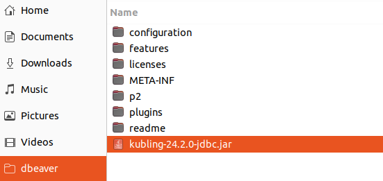
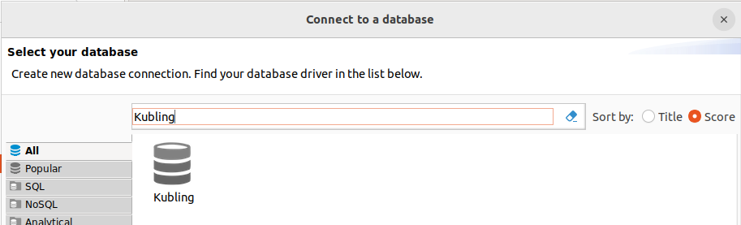

# DBeaver

Internally, we use DBeaver as our primary option for a powerful desktop database tool.

## Configure DBeaver

### 1. Download DBeaver
Go to [DBeaver download page](https://dbeaver.io/download/) and get the latest version.

### 2. Download Driver
You first need to have the `Kubling` JDBC native driver on your local machine. 
Drivers are [published here](https://github.com/kubling-community/kubling-teiid-os/releases). Download latest version and
place it, ideally, in the same directory you installed DBeaver.

### 3. Register Driver
In the top menu, select `Database` > `Driver Manager` and then, in the popup window, press `New`. 

First click on `Libraries` tab and then `Add File`. Then select the recently-downloaded driver:

Go back to `Settings` tab and give the driver a name, like `Kubling`.  
Fill the `Class name` field with `com.kubling.teiid.jdbc.TeiidDriver`. 
Leave all other fields blank and press `OK`.

### 4. Connect to VDB
In the top toolbar, just below the main menu, click on `New Database Connection`. 

Filter `Driver` by name:

The connection string has the following components: 
`jdbc:teiid:[vdb]@mm://[address]:[port]`

Suppose you are running the [`appmodel`](https://github.com/kubling-community/dbvirt-samples/tree/main/appmodel) sample running on `localhost` using default port. 
In this case, your connection string will be: `jdbc:teiid:app@mm://localhost:35482`

Since thos sample does not use `RBAC`, you can leave the `Username` and `Password` fields blank.

At the bottom of the `Connect to a Database` popup, there is a button to test the connection. If everything
works as expected, you should see a message confirming that the connection was successful.

You can now explore `SCHEMAS`, `TABLES`, `COLUMNS`, and other VDB objects, and, of course, write SQL in a much more assisted and efficient way.

## Secure native protocol
In DBeaver, when connecting to a secured native transport, it is mandatory to pass the `connectionPropsFilePath` in the JDBC URL:

`jdbc:teiid:[vdb]@mms://[address]:[port];connectionPropsFilePath=/path/to/client-settings.properties`

See an example [here](/Clients/Drivers/native_jdbc#client-networking-properties-file).

## Why the standard PostgreSQL driver does not work?
When establishing a new connection, DBeaver fetches metadata from the database. 
The way Kubling and PostgreSQL expose metadata differs. 

Therefore, if you attempt to connect using the standard PostgreSQL JDBC driver, the connection itself will succeed and a session will be opened in Kubling, 
but DBeaver will fail when trying to retrieve the metadata.