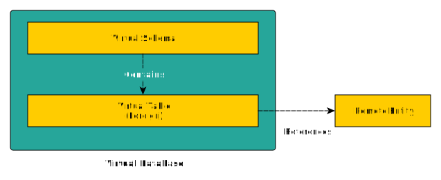

import { Callout, Steps } from 'nextra/components'

# Virtual Database (VDB)

A Virtual Database (or VDB) is a metadata container used to logically integrate data from multiple Data Sources, 
so that they can be accessed in an aggregated way through a single, uniform interface, which is SQL in our case.

VDBs contain Data Sources, and each Data Source contains `SCHEMAS`s which, in turn, contain `TABLE`s. 
Those `TABLE`s are virtual, in the sense that only references foreign entities of foreign data sources.

This hierarchy allows to create an overlay that redefines (or not) the way you access data by adapting `TABLE`s to your particular needs without having
to adapt the remote system's entities.

Note that we use the term 'entity' when referring to the remote counterpart of our `TABLE`s since they can be regular RDBMS `TABLE`s, a document database,
an object repository, an API, etc. 
That is the core of Kubling: you can create a completely virtual data model, relational or not, based on existing remote entities.

