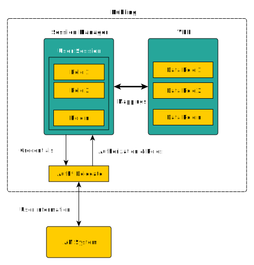

# RBAC

Role-based access control (RBAC) is an industry-standard approach to restricting system access to authorized users. 
In RBAC, permissions are associated with roles, and users are assigned appropriate roles. 
This ensures that only users with the necessary roles can access certain resources or perform specific actions.

Kubling adopted this security model because it allows for the easy definition of general roles to grant access without associating them with specific 
users when defining Virtual Databases.

That is why, in Kubling, you define only abstract roles, but the mapping between those roles and users must still be specified. 
This is because one of the most common, and sometimes troublesome, activities when deploying a new system —especially in an enterprise environment— is 
leveraging existing groups and roles from identity management systems (IAM) to avoid duplicating rules and creating isolated access policies within each system, 
which could lead to security issues.

It is important to highlight that Kubling does not have an internal IAM mechanism. 
Therefore, it always relies on external systems to perform authentication/authorization as well as role reading.

## Data Roles

Data Roles, are sets of fine-grained permissions defined per Virtual Database that specify data access permissions on CRUD operations. 

In a case a Virtual Database is deployed without Data Roles, all Engine's objects (VDB, SCHEMA, TABLE, etc) can be accessed by any valid session without restrictions.

## Permissions

Permissions can be defined per resource. Supported resources are:
- `SCHEMA`
- `TABLE`
- `COLUMN`

When a CRUD operation is received, the engine searches for permissions from the most to the least specific resource paths. 
A resource path is a fully qualified object name (FQN). For example, when a role allows a `READ` (a `SELECT` in SQL) operation at the `SCHEMA.TABLE` level, 
but another role restricts access to a specific `SCHEMA.TABLE.COLUMN`, the restriction is applied.

Example of a permission definition:
```yaml
...
rbacDataRoles:
  - name: "full_control"
    description: "RBAC with full control"
    allowCreateTemporaryTables: true
    roleNameMappings:
      - "ROLE_FULL"
    permissions:
      - resource: "app.KUBLING_DEPLOYMENT"
        resourceType: TABLE
        allowCreate: true
        allowRead: true
        allowUpdate: true
        allowDelete: true
...        
```

## Role Mappings


When the Session Manager receives a connection request and the connection succeeds, it stores the external roles associated with the principals.<br/>
In other words, the roles that a session informs the engine of when performing operations are defined outside of Kubling and have no special meaning to the engine. 
These roles are communicated via an Authentication and Authorization delegate, which is explained in the next section.

When an operation is received via an open and valid session, the engine verifies the `rbacDataRoles` that must be applied to the query and checks whether the session has any of the required 
roles defined in `roleNameMappings`.

## Authentication Script Delegate
As shown in the above diagram, the session manager evaluates an authentication/authorization delegate script. 

Let's explore the following example:
```js showLineNumbers
auth.addPrincipal(auth.userName);
if (auth.userName === "sa") {
    auth.trust();
    auth.addRole("ROLE_FULL");
} else if (auth.userName === "reader") {
    auth.trust();
    auth.addRole("ROLE_ONLY_READ");
} else if (auth.userName === "scout") {
    auth.trust();
    auth.addRole("BAD_ROLE");
} else if (auth.userName === "baddie") {
    auth.locked("Don't even try it again!")
} else {
    auth.bad();
}
```

### `auth`
The object injected into the context, used to exchange information between the script and the session manager.<br/>
It contains the `userName` and `credentials` (password or token) informed by the remote client.<br/>
For more information about the `auth` object, see [here](/Engine/script-context-members#authenticationauthorization-script).

### Principals
You can add all the principals a credential has associations to.
It is deprecated, only kept for compatibility and just informative, from version `24.5.1` it is marked for future removal.

### State
The script must inform the session manager whether the username and credentials received correspond to an existing subject in the IAM, by trusting them or not.<br/>
The only way to accept the connection request and open a sessions is by trusting the `auth` object (line 6).

### Roles
Roles informed via `auth` will be kept at a session level, as shown in the diagram. 
These roles will be matched against `rbacDataRoles.roleNameMappings` for each and every CRUD operations received by the session.

## Connect to an IAM
In real, productive environments you will likely connect to an IAM system in order to login users and get their roles.

In Kubling we use FusionAuth internally, so in our case it looks like the following:

```js showLineNumbers
loginWithId(loginRequest) {
    var request = {
        "url": contextVars.FUSIONAUTH_URL,
        "method": 'POST',
        ...
        "body": JSON.stringify(loginRequest)
    }
    let resp = httpCli.exec(request);
    if (resp.statusCode >= 400) {
        throw new Error(resp.content);        
    } else {
        return JSON.parse(resp.content);        
    }
}

let lReq = new LoginRequest();
lReq.loginId = auth.userName;
lReq.password = auth.credentials;

let lRes = loginWithId(lReq);

auth.trust();
for (let gm of lRes.user.memberships) {
    auth.addRole(gm.groupId);
    ...
}
...
```