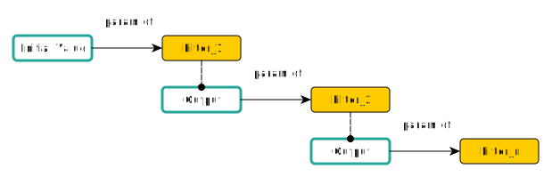

# Template Parser

In Kubling, almost all files are parsed as templates. 
The template parser uses a syntax inspired in the [jinja template engine](https://github.com/pallets/jinja "target=_blank"), which was adopted by some
of the most popular automation tools, meaning that its expressiveness and easiness to read is more than proven.

The files parsed as templates [are listed here.](/schemas)

## Syntax Reference

### `{{ ... }}` delimiter

This delimiter is used to print the result of an expression. Expressions can be as simple as variable value or much more complex, like a the result of a function call.

### `` delimiter

his delimiter is used to change the control flow of the template and to control the template context (variables).

### Variables

When the Engine calls the template parser, depending on the file, a context with a set of variables is injected.<br/>
By default, all contexts will contain the list of environment variables as well as variables defined in the [properties.](properties)

Variables can be printed directly to the output. For example, if the context contains a variable called `main_kube_cluster` which is a 
`string` with the value `cluster_we_1`, the following prints its value:

```yaml
{{ cluster_we_1 }}
```

Context can also contain `Objects` (whose schema id is `schema:kubling:InnerObject`), which can be accessed using dot-notation to move trough its hierarchy:

```yaml
{{ kube_clusters.fullList.cluster_we_1 }}
```

It is important to note that the parser is not strict when checking the `Object`, therefore if `kube_clusters` or `kube_clusters.fullList` are `null`,
an empty `string` will be printed.

### Filters

Filters are a simplified way of passing values through a chain of filter functions. Filters are separated using a pipe symbol `|`, and direction of processing is natural,
that is, from left to right.<br/>


Sample:
```yaml
{{ kube_clusters.fullList.cluster_we_1 | lower | someFunc(another_param) }}
```

### Functions

Functions are called using the standard notation, the value they return can be used in two different ways: 

#### 1. Set a new context variable 

```yaml

```

#### 2. Print the value out

```yaml
{{ getFirstMatchField(vdb=_context.vdb, entity=_context.pm_schema + '.JIRA_USER', field='accountId', filters='displayName=' + enclose_string_param(_context.jiraUserName)) }}
```

#### Arguments

The values passed as arguments to the function can be positional and named (also known as keyword), as shown in the samples above.

Besides, arguments values can be the result of an operation. For example, in the second example above, the argument `filters` is the `string` concatenation between a constant value
`'displayName='` and the value returned by the function `enclose_string_param`.

If you need to pass a context variable (do not confuse with print the value), the way to access it is via dot-notation starting from the root `_context` object, like `_context.jiraUserName`.

### Control

#### `if` statement

The `if` statement allows to conditionally print a section of the content depending on the result of an [expression](#expressions).

General usage:
```yaml

    ...

	...

	...

```

Sample:
```yaml

    aggregatorSchemaModels:
      - name: "k8s"
        schemas:
          - "k8s_1"
          - "k8s_2"
        tables:
          - name: "DEPLOYMENT"
    ...

```

#### `for` loop

The `for` loop allows to iterate over `array`s and key-value pairs, like `schema:kubling:InnerObject`.

```yaml

  {{ element.field }}

```

`for` has a mechanism to check whether the iterable `Object` is empty, and execute a block, as follows:

```yaml

  {{ element.field }}

  ...

```

When inside the `for` block, some context objects are injected which you may be useful:
- `loop.index`: a zero-based index that increments with every iteration.
- `loop.length`: the size of the object we are iterating over.
- `loop.first`: `true` if first iteration
- `loop.last`: `true` if last iteration
- `loop.revindex`: The number of iterations from the end of the loop

Sample:
```yaml

    aggregatorSchemaModels:
      - name: "k8s"
        schemas:
        
          - {{ k8sSchema.name }}
        
    ...

```

### Expressions

#### Literals
The most basic form of expressions are literals, such as `string`, `number` and `boolean`.

- `"Data Source"`: Strings can be enclosed between two double or single quotes. Backslash is supported to escape quotation marks within the string.
- `"type: #{type}"`: String interpolation is also possible using #{} inside quotes. 
- `1 + 10l * 82.5`: `integers`, `long` and floating point numbers in action.
- `true` / `false`: Boolean values.
- `null`: Represents a "no value". `none` is an alias for `null`.

#### Collections
Lists and key-value pairs can be created directly within the template. Collections can also contain expressions.

- `["dataSource1", "dataSource2", "dataSource3"]`: A list of `string`s
- `{"name":"dataSource1", "url":"https://myapi.com", "token":"mytoken"}`: A key-value pair of `string`s

#### Math

Parser can calculate values using basic mathematical operators. The following operators are supported:

- `+`: Addition
- `-`: Subtraction
- `/`: Division
- `%`: Modulus
- `*`: Multiplication

#### Logic

- `and`: Returns `true` if both operands are `true`
- `or`: Returns `true` if either operand is `true`
- `not`: Negates an expression
- `(...)`: Groups expressions together

#### Comparisons

Comparisons can be used in any expression.

- `==`: Equals to.
- `!=`: Not equal to.
- `<`: Less than.
- `>`: Greater than.
- `>=`: Greater than or equal.
- `<=`: Less than or equal.

Sample:
```yaml

    aggregatorSchemaModels:
      - name: "k8s"
        schemas:
        ...

```

#### Tests
Parser supports a more friendly way of testing expressions, using the operator `is`.

Sample:
```yaml

    aggregatorSchemaModels:
      - name: "k8s"
        schemas:
        ...

```

#### Conditional (ternary) operator
This operator is also supported by the parser.
Sample:
```yaml
{{ foo ? "yes" : "no" }}
```

#### Operator Precedence

- `.`
- `|`
- `%`, `/`, `*`
- `-`, `+`
- `==`, `!=`, `>`, `<`, `>=`, `<=`
- `is`, `is not`
- `and`
- `or`

### Comments

Comments are delimited by `{# ... #}`. Their content is not printed in the final output.