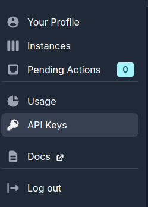
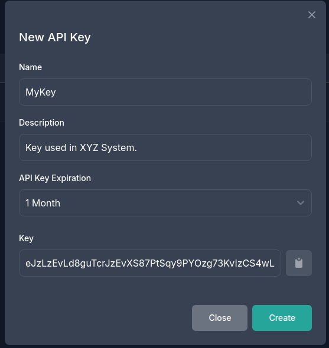

import { Callout } from 'nextra/components'

# Configuring the Kubling Agent Platform

To use the **Kubling Agent Platform** as your agentic backend, you’ll need to create an account, generate an API key, and configure your Kubling instance to connect to the platform.

Follow the steps below to get started:

---

## 1. Create an Account

Go to [https://dash.kubling.com](https://dash.kubling.com) and sign up using your email, or authenticate with your Microsoft or GitHub account.

---

## 2. Access API Keys

Once logged in, navigate to **API Keys** in the left-hand side menu.



---

## 3. Create a New API Key

Click the **Create New API Key** button.



You will be prompted to name the key and choose an expiration. Once generated, the key will be shown **only once**.

---

## 4. Save the API Key

Copy the generated API key and store it in a secure location. You’ll need this key when configuring your Kubling instance.

<Callout type="warning">
  Kubling does not store the raw API key—only a hashed representation. This means the key cannot be retrieved or shown again once you leave the screen.  
  If lost, you'll need to generate a new one.
</Callout>

---

## 5. Configure Kubling Instance

By default, Kubling expects the API key to be provided through the `KUBLING_AGENT_TOKEN` environment variable.

<Callout>
  **Note:** In Kubling, the terms _token_ and _key_ are used interchangeably. However, in the documentation, we consistently refer to it as a **key** to avoid confusion with LLM tokens.
</Callout>

You can provide the key in one of the following ways:

- **As an environment variable**  
- **In a properties file**, using the `propertiesFilePath` setting in your configuration  
- **Directly in the application configuration**, as shown below:


```yaml
properties:
  KUBLING_AGENT_TOKEN: "<your-api-key>"

kublingAgent:
  enabled: true
  instanceIdentifier: "<your-instance-identifier>"
  api:
    baseURL: "https://agent.kubling.com/api/v1"
    keepAlive:
      activated: true
```