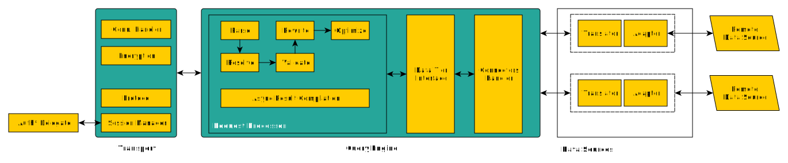

import { Callout } from 'nextra/components'

# Architecture

We assume that for the majority of Kubling users, knowing the internal architecture of the Engine is somehow irrelevant.

However, most of the concepts presented in this documentation, particularly those related to Data Sources, are connected to the architecture.

The following diagram is a simplified view of the architecture, in which we highlight pieces that will be affected by your configuration and modules.

## Transport

The transport layer groups all the services to manage client connections. Kubling is designed to decouple the protocol from the connection handler,
reason why it is possible to configure transports as `nativeProtocol` or `pgProtocol`. 
The latter refers to PostgreSQL protocol, which allows you to exchange information with Kubling using standard PostgreSQL client.

<Callout type="warning">
  Do not confuse PostgreSQL protocol with PostgreSQL system. Some clients, after opening a connection with a PostgreSQL server, try to fetch metadata
  by querying system tables. 
  Kubling does not name system tables (and their columns) as PostgreSQL does, therefore that metadata fetching will likely fail.
</Callout>

### Encryption
When securing a transport via configuration, the encryption will be done using the certificate you specify. Otherwise, encryption is skipped.

### Session Manager
It opens and keeps all the sessions created by remote clients. If your [descriptor module](/Modules/descriptor) 
specifies an [authentication delegate](/schemas#descriptor-bundle-information-file-bundle-infoyaml), then the manager will invoke it before the sessions
is created.

## Query Engine

The query engine in Kubling is responsible for coordinating all components involved in Distributed Query Processing (DQP). 
DQP refers to the method, widely used in the database industry, that enables systems like Kubling to split a query into multiple independent tasks. 
These tasks are distributed among workers, with each worker processing a portion of the query. The intermediate results are then collected, organized, 
and merged to produce a final result set. 
Each worker or group of workers is typically specialized in a specific Data Source, allowing the DQP to process a single query that spans multiple Data Sources.

Although Kubling doesn't operate as a traditional distributed system—since you don't need to set up separate workers—DQP still plays a crucial role in query execution. 
In Kubling, all processing happens within the same Engine (the same process ID) and is managed by its internal threads. 
This approach retains the foundational concepts of DQP, ensuring that complex queries can be efficiently divided and processed in parallel.

Understanding DQP is particularly important for grasping how Kubling's Document Script Modules operate. 
These modules rely on DQP principles to handle the parsing and processing of semi-structured data like `JSON` and `YAML`, 
ensuring the efficiency and scalability of query execution within the Engine.

### Buffers
In Kubling, buffers are essential for managing memory and disk storage for temporary data used during query processing.

When the Distributed Query Processor (DQP) fetches information from multiple sources, each intermediate result is treated 
as temporary and may undergo pre-sorting, pre-aggregation, and other transformations before being merged into the final result. 
When these temporary result sets are large, they can consume substantial memory, potentially impacting instance performance.

To address this, the buffer manager coordinates resource access and transparently spills data to disk as needed, 
ensuring that queries can handle large datasets without exhausting memory.

By default, Kubling buffers use a combination of memory and disk. 
However, for testing or short-lived instances, disk storage can be disabled, allowing all operations to be handled entirely in memory.

## SQL Query
When a new SQL query is received from an active session, it is first parsed into a command, which contains the necessary metadata to construct a logical execution plan.

At this point, the query could be rejected due to restrictions in capabilities informed when configuring the translator.
If accepted, the logical plan is then optimized and converted into a final processor plan based on a cost analysis, 
which determines the most efficient way to execute the query.

## Data Access & Data Sources
When the Engine performs queries against different Data Sources (DS), it utilizes a connection pool for each source. 
A connection is borrowed from the pool whenever a query needs to be executed.

In practice, the Engine uses a standardized interface to interact with all data sources, treating them uniformly. 
Regardless of the specific DS type, the Engine's role is to route the query to the appropriate adapter and await the result, which is returned as a standard result set.

Each Adapter is responsible for translating standard SQL queries into operations that the remote data source can process, such as retrieval (fetch), 
insert, update, or delete operations. The translation process is complex because the capabilities of the data source may vary, 
meaning not all SQL features supported by Kubling are compatible with every remote DS. This is why configuring a new Data Source requires 
specifying a translator configuration—it defines the DS's supported features so the Engine knows which queries to accept or reject.

Additionally, Script Modules function as specialized adapters capable of processing semi-structured documents like `JSON` or `YAML`. 
Through scripts, these modules handle fetching, inserting, updating, and deleting od documents from remote APIs.

## Immutability

In our context, **immutability** refers to the **inability** to modify critical system components via external signals during an execution lifecycle. 
The only way to alter these components is through configuration updates.

Traditional databases are not designed to be reconfigured and restarted every time a change in the Schema's structure is needed, the full explanation exceeds this documentation
but, in short, it is due to historical reasons and the way mission critical and transactional systems were deployed couple of decades ago.

Kubling, on the other hand, is built to run in containerized environments, making it suitable for CI/CD deployment like any other modern application. 
Instead of altering schemas and tables on the fly, Kubling treats these objects as integral to the current running instance. 
When changes are necessary, users modify the configuration and redeploy the instance.

If an issue arises, you could easily roll back to a previous version using CI/CD pipelines or workflows, ensuring both flexibility and consistency in operations.
