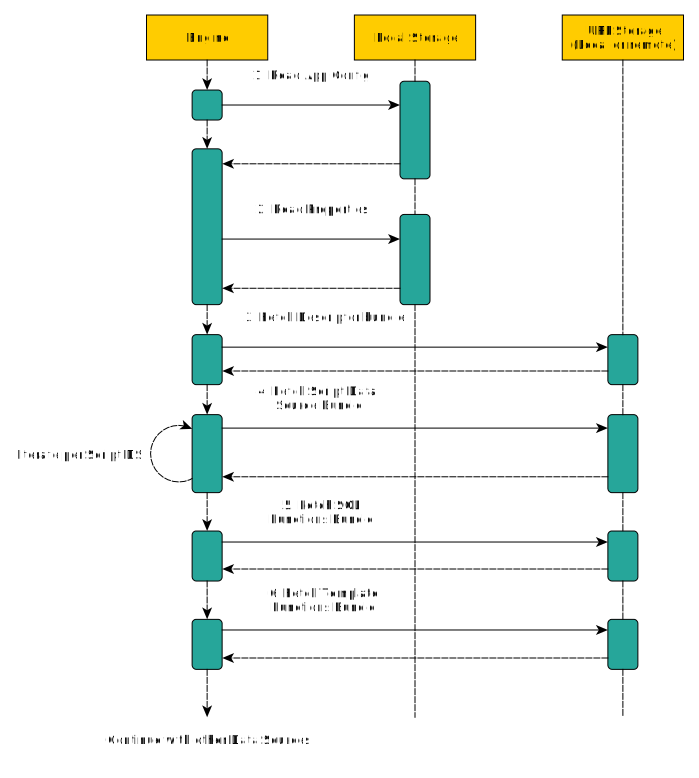
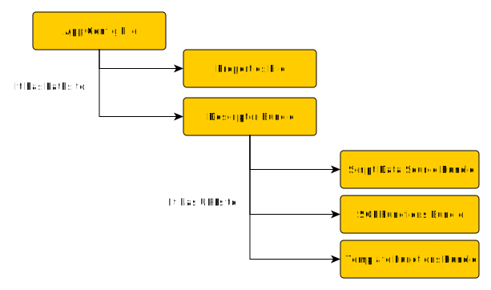

import { Callout } from 'nextra/components'

# Artifacts

## Initialization process

The first file Kubling engine reads during initialization is the application configuration, whose location is resolved via `APP_CONFIG` environment variable.

That configuration contains top-level options and the location of the next loading artifact, which is the descriptor bundle.

In turn, descriptor bundle contains the list of Data Sources, that can be of the type `Module` which are also resolved using the same loading mechanism.

Note that the only local file needed by the engine is the application configuration, since the rest of the artifacts can be fetched from remote origins.

<Callout>
  All artifacts (or `zip` files) **but the application configuration** are referred as `Module` in the Kubling universe. A `Module` should follow the CI/CD principle, that is, have a versioning strategy and a 
  release cycle.
</Callout>

## Artifacts

### Application Configuration
A `YAML` file that contains top-level options. 
[Check the configuration schema here.](/schemas#main-application-configuration)

### Descriptor Bundle
A module file that contains Virtual Databases descriptors, and the location of actions/queries descriptors. 
The bundle has a meta configuration file, which is used by the Engine to get information about what the descriptor contains. [Check its schema here.](/schemas#descriptor-bundle-information-file-bundle-infoyaml)

Each Virtual Database (VDB) definition listed in the descriptor's meta configuration file, needs to also be configured. [Check its schema here.](/schemas#virtual-database-information-file-located-inside-the-descriptor-bundle)

### Script Data Source Bundle
A module file that contains an [information file](/schemas#script-module-bundle-information-file-bundle-script-infoyaml) (descriptor) as well as the script code to load a delegation data source (that is the term we use internally to refer to a data source that does not open a connection against 
a remote origin, but delegates CRUD operations to scripts).

### SQL Functions Bundle

A module file that contains an [information file](/schemas#sql-function-module-bundle-information-file-bundle-sql-function-infoyaml) and script functions to be added to the Engine's **SQL function catalog**. 
[See how to create it.](/Modules/Functions/SQL)

### Template Functions Bundle

A module file that contains an [information file](/schemas#template-function-module-bundle-information-file-bundle-function-infoyaml) and script functions to be added to the Engine's **Template function catalog**. 
[See how to create it.](/Modules/Functions/Template)

## Dependecy

As a complement to the initialization sequence diagram, the following diagram shows the artifacts dependency, that is, what artifact contains the Path/URL to resolve the next artifact.

