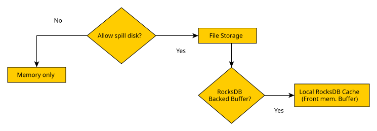

import { Callout } from 'nextra/components'

# Buffer Manager

## Overview

The Buffer Manager is one of the core execution components in Kubling and is responsible for controlling how temporary execution data is handled while queries run.

During execution, Kubling frequently processes significantly more information internally than what is eventually returned to the client.

For example:

```sql
SELECT *
FROM Events e
JOIN Clusters c ON ...
WHERE ...
```

may ultimately return:

```
250 rows
```

while internally processing:

```
10,000+ intermediate rows
```

through:

- source reads
- joins
- sorting
- aggregations
- grouping
- transformations
- temporary execution structures

These intermediate structures can often become substantially larger than the final result itself.

The Buffer Manager ensures that these temporary datasets can be processed efficiently without requiring all execution data to remain entirely in memory.

Without buffering, query execution would eventually become constrained by available memory.

Large intermediate datasets could result in:

- memory exhaustion
- unstable execution behavior
- reduced concurrency
- inability to process larger workloads

The Buffer Manager continuously determines where temporary information should live during execution:

```
Query execution
        ↓
Temporary data generation
        ↓
Buffer Manager
        │
        ├── Memory
        │
        └── Persistent storage (optional)
        ↓
Final result
```

Its primary objective is not necessarily reducing execution time.

Instead, its role is usually:

- improving execution stability
- controlling resource consumption
- supporting larger workloads+
- maintaining predictable behavior under load

## Buffering modes

Buffering behavior is controlled through two independent decisions:

1. Whether temporary information may spill to local storage
2. Which persistence implementation should be used

Conceptually:



## Configuration

Because the Buffer Manager affects how the execution engine is constructed and initialized, 
it is configured at the [application level](/schemas#main-application-configuration) under the `buffer` section.

### Memory-only mode

```yaml
buffer:
  useDisk: false
```

All temporary execution structures remain entirely in memory.

Characteristics:

- lowest execution overhead
- no storage activity
- minimal serialization

Trade-offs:

- constrained by available memory
- unsuitable for larger intermediate datasets

Typical use cases:

- development environments
- lightweight workloads
- testing environments
- short-lived instances

### Standard buffering

```yaml
buffer:
  useDisk: true
  directory: some/local/dir
```

Temporary information may spill into local storage when required.

This is the default general-purpose buffering strategy.

Characteristics:

- supports larger workloads
- balances memory consumption
- suitable for most deployments

Trade-offs:

- additional I/O activity
- serialization overhead

Typical use cases:

- production deployments
- mixed workloads
- unpredictable execution patterns

### RocksDB buffering

Example:

```yaml
buffer:
  useDisk: true
  directory: some/local/dir
  rocksBackedBuffer:
    enabled: true
```

RocksDB buffering replaces the traditional offset-based storage strategy with an object-oriented persistent cache designed for more demanding workloads.

Rather than focusing exclusively on temporary file management, RocksDB improves behavior when substantial amounts of temporary information are generated.

Characteristics:

- handles large temporary datasets efficiently
- improves behavior under sustained memory pressure
- scales better for larger intermediate structures
- better suited for higher query concurrency

Trade-offs:

- additional serialization work
- increased storage activity
- may introduce small overhead for lightweight workloads

Typical use cases:

- large source-to-result ratios
- substantial temporary structures
- high concurrency workloads
- constrained-memory environments
- deployments expected to process hundreds of MB of intermediate data

#### RocksDB full configuration

RocksDB buffering exposes additional tuning options intended for environments with specific performance or resource requirements.

The default values are suitable for most deployments and changing them is typically unnecessary unless workload characteristics are well understood.

Example:

```yaml
buffer:
  ...
  rocksBackedBuffer:
    enabled: true
    maxStorageSpace: 10737418240
    maxOpsPerCommit: 10000
    maxOpenFiles: 1024
    writeBufferSize: 67108864
    backgroundThreads: 2
    inlineLobThresholdBytes: 1048576
```

| Property                  | Default | Description                                                                                     |
|---------------------------|---------|-------------------------------------------------------------------------------------------------|
| `enabled`                 | `false` | Enables RocksDB-backed buffering.                                                               |
| `maxStorageSpace`         | `10GB`  | Maximum amount of disk space (in bytes) that Rocks-backed buffer storage is allowed to consume. |
| `maxOpsPerCommit`         | `10000` | Number of accumulated write operations before a RocksDB batch commit is executed.               |
| `maxOpenFiles`            | `1024`  | Maximum number of RocksDB files allowed to remain open simultaneously.                          |
| `writeBufferSize`         | `64MB`  | Size of the RocksDB memtable used for buffering writes.                                         |
| `backgroundThreads`       | `2`     | Number of background compaction and flush threads used by RocksDB.                              |
| `inlineLobThresholdBytes` | `1MB`   | Maximum LOB size allowed to remain inline inside tuple batches before using File Store.         |

<Callout type="info">
Defaults are intentionally conservative and target a wide range of environments, including small edge devices and general-purpose deployments.
Increasing values such as `writeBufferSize`, `backgroundThreads`, or `maxOpsPerCommit` may improve throughput for large workloads, 
but may also increase memory consumption and storage activity.
</Callout>

#### Adaptive LOB inlining

RocksDB buffering introduces an adaptive LOB inlining strategy that may alter how certain LOB-backed types are persisted during execution.

Traditionally, large object types (LOBs) such as JSON, YAML, XML, CLOB and binary-backed values were frequently materialized into File Store structures.

With RocksDB buffering enabled, Kubling may instead persist selected LOB values directly inside tuple batches when:

- adaptive LOB support is enabled
- the type supports inline persistence
- the estimated size is below the configured threshold

Conceptually:

```md
LOB encountered
      │
      ▼
Supported inline type?
      │
      ├── No
      │       ↓
      │   Legacy behavior
      │
      └── Yes
              │
              ▼
      Size <= threshold?
              │
      ├── Yes
      │       ↓
      │   Inline into tuple batch
      │
      └── No
              ↓
          File Store
```

Inline persistence reduces the need to create external File Store objects and may improve behavior for workloads containing substantial amounts of small JSON/YAML/XML values.

Some impact to consider:

- larger tuple batches
- increased serialization work
- additional memory pressure during write bursts

## Choosing a mode

There is no universally optimal configuration.

| Scenario                       | Recommended mode   |
|--------------------------------|--------------------|
| Development or testing         | Memory only        |
| Small temporary datasets       | Memory only        |
| General production workloads   | Standard buffering |
| Large intermediate datasets    | RocksDB            |
| High memory pressure           | RocksDB            |
| High query concurrency         | RocksDB            |
| Large JSON/YAML/XML processing | RocksDB            |

## Performance considerations

Additional buffering should not be viewed as a direct performance optimization.

For smaller workloads, enabling persistence mechanisms frequently introduces additional work:

- storage operations
- serialization
- memory management overhead

As a result, lightweight workloads may execute slightly faster using simpler buffering strategies.

For larger workloads, however, improved resource behavior often outweighs the additional overhead.

In practice:

```md
Small workloads
        ↓
Memory-only frequently performs best
---
Medium workloads
        ↓
Standard buffering frequently provides the best balance
---
Large workloads
        ↓
RocksDB frequently provides more stable behavior
```

<Callout type="info">
[Performance Tracer](/perf/intro) can be used to analyze execution characteristics and determine whether an alternative buffering strategy may provide better results.
</Callout>
