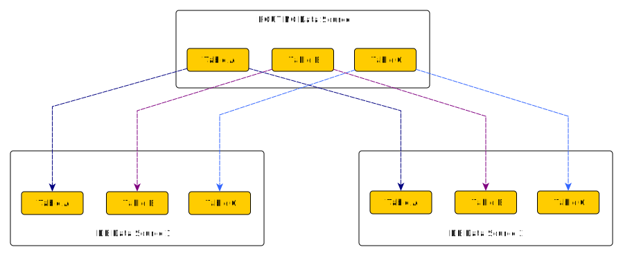

import Tag from '../../../component/Tag'
import { Callout } from 'nextra/components'

# Routing Data Source (`ROUTING`) <Tag description={"v25.1+"} /> <Tag bgColor={"bg-kubling-dark-violet"} txtColor={"text-white"} description={"PREVIEW"} txtFont={"font-gilroyBold"} />

The **Routing Data Source** is a **proxy data source** that allows you to route commands to different data sources based on rules.  

This is a fundamental piece when designing petabyte-scale decentralized operational data infrastructures.

## Configuration
<details>
<summary>Routing Source configuration</summary>
```yaml
type: "object"
id: "schema:kubling:dbvirt:model:vdb:sources:SimpleRoutingSourceConfig"
properties:
  strict:
    type: "boolean"
    description: "Specifies whether the engine should return an error if no rule matches\
      \ the command. When set to false, the engine will use the default routing behavior."
  defaultTo:
    type: "string"
    description: "Specifies the schema to which the command should be routed if no\
      \ rule matches, when in non-strict mode. If this value is not provided, the\
      \ engine defaults to routing the command to the first schema in the import list."
  imports:
    type: "array"
    items:
      type: "object"
      id: "schema:kubling:dbvirt:translation:model:routing:ImportElement"
      properties:
        dataSource:
          type: "string"
        tableNamePattern:
          type: "string"
  rules:
    type: "array"
    items:
      type: "object"
      id: "schema:kubling:dbvirt:translation:model:routing:SimpleRoutingRule"
      properties:
        tableNamePattern:
          type: "string"
        toDataSource:
          type: "string"
        field:
          type: "string"
        comparison:
          type: "string"
          enum:
          - "EQUAL"
          - "NOT_EQUAL"
          - "GREATER_THAN"
          - "GREATER_THAN_OR_EQUAL"
          - "LESS_THAN"
          - "LESS_THAN_OR_EQUAL"
        value:
          type: "string"
```
</details>

## When to Use Routing

#### **Scaling non-horizontally-scalable remote data sources**
One of the most common concerns when designing an application, service, or platform is the scalability of RDBMS solutions like **PostgreSQL** and **MySQL/MariaDB**, since they do not 
scale horizontally by default. While there are alternative solutions (e.g., database engines based on them that can scale horizontally or NoSQL engines), most organizations continue using traditional RDBMS systems 
and implement "sharding" by logically segmenting data, such as by **region, country, or tenant**.

That logic is usually implemented at the networking level, routing requests to the appropriate database or service cluster that holds the relevant data.

The `ROUTING` data source enables **a single cluster of applications and services** to be connected to a Kubling instance (or a mesh, in a productive environment), which then dynamically routes operations 
to the correct remote data source. This eliminates the need for complex networking configurations, avoids application-side routing logic, and removes the requirement 
to isolate workloads into separate clusters or namespaces (such as in Kubernetes).

## Configuration

Let's begin by examining the following diagram, which provides a simplified overview of how routing works:


- **Remote Data Sources**: These are database instances that share the same schema. For example, they could be PostgreSQL instances that store client-related information, distributed across different regions.
- **Kubling Database Data Sources**: Each remote data source has a corresponding configuration in Kubling as a standard database data source.
- **`ROUTING` Data Source**: This component is aware of the configured Kubling data sources and dynamically routes commands based on predefined rules.

### Import Mechanism

One key aspect of the `ROUTING` data source is that it does not establish direct connections with remote databases. Like other **proxy data sources** (such as `COMPOSITE`), it relies on existing data sources.

During initialization, the `ROUTING` data source inspects the schemas of all referenced data sources and **adds tables only once if their names match the import patterns**.  
However, if multiple schemas contain tables with identical names, the engine assumes they are equivalent and **performs a schema equivalence check** before allowing routing.  

The schema equivalence check ensures that:
- Column names match across all instances.
- Column data types are consistent.  

Importantly, **this check does not validate table `OPTIONS`**, meaning you can configure specific directives for each imported data source as needed.



### Routes
The following example configures routes based on matching rules:
```yaml
- name: "routing"
  dataSourceType: "ROUTING"
  configObject:
    dataSourceName: "routing"
    imports:
      - dataSource: "CLIENTS_DC1"
        tableNamePattern: ".+"
      - dataSource: "CLIENTS_DC2"
        tableNamePattern: ".+"
    rules:
      - tableNamePattern: "CLIENT"
        field: "data_center"
        comparison: EQUAL
        value: "DC1"
        toDataSource: "CLIENTS_DC1"
      - tableNamePattern: "CLIENT"
        field: "data_center"
        comparison: EQUAL
        value: "DC2"
        toDataSource: "CLIENTS_DC2"
...        
```

The `imports` section controls which tables to import from each data source, allowing for a **routing strategy over a subset of the schema**.

However, **imported tables must have the same name** across all data sources for routing to function correctly.

If table names differ, the engine will not recognize them as "equivalent," resulting in multiple distinct tables in the routing schema, which may lead to unintended behavior.

The `rules` section determines how commands are routed based on:

- **The table name**: Specifies which table the rule applies to.
- **Simple field comparisons**: Defines conditions that must be met for the rule to apply.

Each rule consists of:
- `tableNamePattern`: The name (or regex pattern) of the table involved in the command.
- `field`: The column used for filtering.
- `comparison`: The type of comparison (`EQUAL`, `NOT_EQUAL`, `GREATER_THAN`, `GREATER_THAN_OR_EQUAL`, `LESS_THAN`, `LESS_THAN_OR_EQUAL`).
- `value`: The expected value for the field.
- `toDataSource`: The target data source where matching queries will be routed.

Note that **the order of the rules matters!**  
That is, the **first** rule that matches the criteria will be used to perform the routing, discarding the subsequent rules.

### Default route
In case you want to route to a default data source when no rule is a match, you can do so by defining a `defaultTo` as follows:
```yaml
- name: "routing"
  dataSourceType: "ROUTING"
  configObject:
    imports: ...
    rules: ...
    defaultTo: CLIENTS_GLOBAL
...
```

Note that `defaultTo` applies to **all tables**.

If no rule matches and a default route is not defined, the command will be rejected, and the client will receive an error.

<Callout type="info">
  We are evaluating adding a script-based `ROUTING` data source, which would allow defining routes using functions, similar to how [SQL functions work](/Modules/Functions/SQL#ddl-function-script).  
  However, due to the nature of this data source (which must be capable of handling hundreds of commands per second), we are conducting performance tests to assess whether this feature is viable.
</Callout>
