# Query Grammar (EBNF)

This section defines the formal grammar accepted by the Kubling query engine.

The grammar below is normative and versioned. All statements parsed by the engine must conform to this specification.


The section below provides both the raw EBNF specification and a visual representation using [railroad diagrams](https://github.com/GuntherRademacher/rr).

**stringVal:**

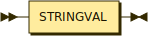

```
stringVal
         ::= STRINGVAL
```

referenced by:

* charVal
* createDatabase
* createNameSpace
* createServer
* function
* grant
* importDatabase
* jsonColumn
* jsonTable
* namespaceItem
* nonNumericLiteral
* objectColumn
* objectTable
* textColumn
* textTable
* useDatabase
* xmlColumn
* xmlExists
* xmlQuery
* xmlSerialize
* xmlTable

**nonReserved:**

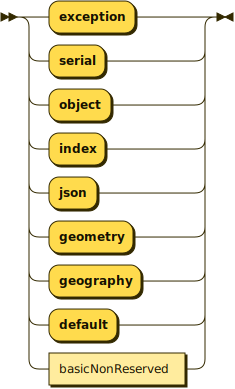

```
nonReserved
         ::= 'exception'
           | 'serial'
           | 'object'
           | 'index'
           | 'json'
           | 'geometry'
           | 'geography'
           | 'default'
           | basicNonReserved
```

referenced by:

* id
* unqualifiedId
* unsignedValueExpressionPrimary

**basicNonReserved:**

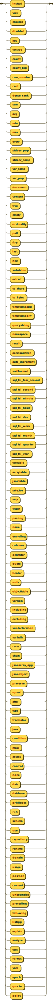

```
basicNonReserved
         ::= 'instead'
           | 'view'
           | 'enabled'
           | 'disabled'
           | 'key'
           | 'textagg'
           | 'count'
           | 'count_big'
           | 'row_number'
           | 'rank'
           | 'dense_rank'
           | 'sum'
           | 'avg'
           | 'min'
           | 'max'
           | 'every'
           | 'stddev_pop'
           | 'stddev_samp'
           | 'var_samp'
           | 'var_pop'
           | 'document'
           | 'content'
           | 'trim'
           | 'empty'
           | 'ordinality'
           | 'path'
           | 'first'
           | 'last'
           | 'next'
           | 'substring'
           | 'extract'
           | 'to_chars'
           | 'to_bytes'
           | 'timestampadd'
           | 'timestampdiff'
           | 'querystring'
           | 'namespace'
           | 'result'
           | 'accesspattern'
           | 'auto_increment'
           | 'wellformed'
           | 'sql_tsi_frac_second'
           | 'sql_tsi_second'
           | 'sql_tsi_minute'
           | 'sql_tsi_hour'
           | 'sql_tsi_day'
           | 'sql_tsi_week'
           | 'sql_tsi_month'
           | 'sql_tsi_quarter'
           | 'sql_tsi_year'
           | 'texttable'
           | 'arraytable'
           | 'jsontable'
           | 'selector'
           | 'skip'
           | 'width'
           | 'passing'
           | 'name'
           | 'encoding'
           | 'columns'
           | 'delimiter'
           | 'quote'
           | 'header'
           | 'nulls'
           | 'objecttable'
           | 'version'
           | 'including'
           | 'excluding'
           | 'xmldeclaration'
           | 'variadic'
           | 'raise'
           | 'chain'
           | 'jsonarray_agg'
           | 'jsonobject'
           | 'preserve'
           | 'upsert'
           | 'after'
           | 'type'
           | 'translator'
           | 'jaas'
           | 'condition'
           | 'mask'
           | 'access'
           | 'control'
           | 'none'
           | 'data'
           | 'database'
           | 'privileges'
           | 'role'
           | 'schema'
           | 'use'
           | 'repository'
           | 'rename'
           | 'domain'
           | 'usage'
           | 'position'
           | 'current'
           | 'unbounded'
           | 'preceding'
           | 'following'
           | 'listagg'
           | 'explain'
           | 'analyze'
           | 'text'
           | 'format'
           | 'yaml'
           | 'epoch'
           | 'quarter'
           | 'policy'
```

referenced by:

* createDomain
* nonReserved
* parseDataType

**unqualifiedId:**


```
unqualifiedId
         ::= ID
           | nonReserved
```

referenced by:

* createDDLProcedure
* createDataWrapper
* createForeignOrGloablTable
* createForeignTempTable
* createRole
* createServer
* createTempTable
* createView

**id:**

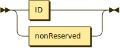

```
id       ::= ID
           | nonReserved
```

referenced by:

* alter
* alterChildOptionPair
* alterColumn
* alterDatabase
* alterDropColumn
* alterOptionPair
* alterProcedure
* alterRenameColumn
* alterRenameTable
* alterServer
* alterTable
* alterTranslator
* alterTrigger
* arrayTable
* assignStatement
* branchingStatement
* callableStatement
* columnList
* compoundStatement
* createColumn
* createDataWrapper
* createDatabase
* createElementsWithTypes
* createForeignTempTable
* createNameSpace
* createPolicy
* createSchema
* createTrigger
* createViewColumn
* declareStatement
* delete
* derivedColumn
* dropChildOption
* dropDataWrapper
* dropOption
* dropPolicy
* dropProcedure
* dropRole
* dropSchema
* dropServer
* dropTable
* dropTableView
* dynamicCommand
* exceptionReference
* executeNamedParams
* foreignKey
* function
* grant
* identifierList
* importDatabase
* importSchema
* insert
* into
* jsonColumn
* jsonTable
* loopStatement
* namespaceItem
* objectColumn
* objectTable
* option
* optionPair
* procedureParameter
* procedureRsColumn
* queryPrimary
* revokeGrant
* selectExpression
* setClauseList
* statement
* storedProcedure
* subqueryFromClause
* tableConstraint
* tableElement
* textAgg
* textColumn
* textTable
* unaryFromClause
* update
* useDatabase
* useSchema
* withListElement
* xmlColumn
* xmlElement
* xmlSerialize
* xmlTable

**command:**

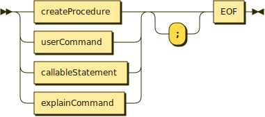

```
command  ::= ( createProcedure | userCommand | callableStatement | explainCommand ) ';'? EOF
```

**createTrigger:**

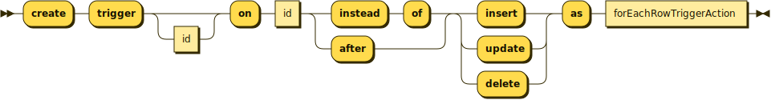

```
createTrigger
         ::= 'create' 'trigger' id? 'on' id ( 'instead' 'of' | 'after' ) ( 'insert' | 'update' | 'delete' ) 'as' forEachRowTriggerAction
```

referenced by:

* ddlStmt
* userCommand

**alter:**

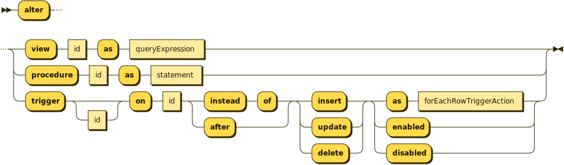

```
alter    ::= 'alter' ( 'view' id 'as' queryExpression | 'procedure' id 'as' statement | 'trigger' id? 'on' id ( 'instead' 'of' | 'after' ) ( 'insert' | 'update' | 'delete' ) ( 'as' forEachRowTriggerAction | 'enabled' | 'disabled' ) )
```

referenced by:

* userCommand

**forEachRowTriggerAction:**

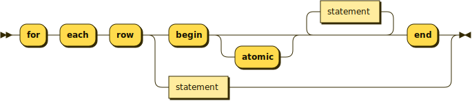

```
forEachRowTriggerAction
         ::= 'for' 'each' 'row' ( 'begin' 'atomic'? statement* 'end' | statement )
```

referenced by:

* alter
* alterTrigger
* createTrigger

**explainCommand:**

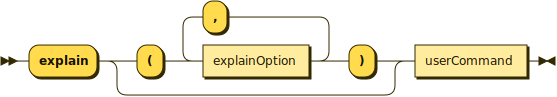

```
explainCommand
         ::= 'explain' ( '(' explainOption ( ',' explainOption )* ')' )? userCommand
```

referenced by:

* command

**explainOption:**

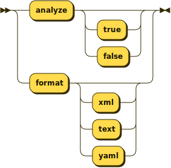

```
explainOption
         ::= 'analyze' ( 'true' | 'false' )?
           | 'format' ( 'xml' | 'text' | 'yaml' )?
```

referenced by:

* explainCommand

**userCommand:**

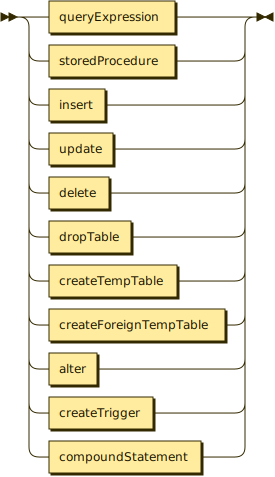

```
userCommand
         ::= queryExpression
           | storedProcedure
           | insert
           | update
           | delete
           | dropTable
           | createTempTable
           | createForeignTempTable
           | alter
           | createTrigger
           | compoundStatement
```

referenced by:

* command
* explainCommand
* sqlStatement

**dropTable:**

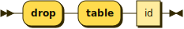

```
dropTable
         ::= 'drop' 'table' id
```

referenced by:

* userCommand

**createTempTable:**

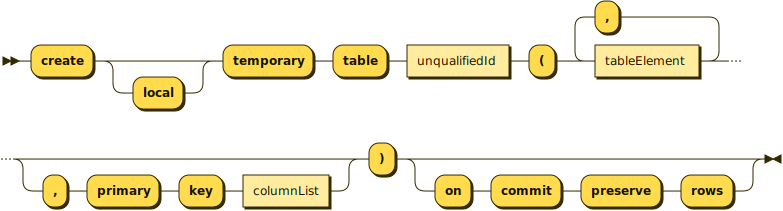

```
createTempTable
         ::= 'create' 'local'? 'temporary' 'table' unqualifiedId '(' tableElement ( ',' tableElement )* ( ',' 'primary' 'key' columnList )? ')' ( 'on' 'commit' 'preserve' 'rows' )?
```

referenced by:

* userCommand

**tableElement:**


```
tableElement
         ::= id ( parseBasicDataType | 'serial' ) ( 'not' 'null' )?
```

referenced by:

* createTempTable

**errorStatement:**

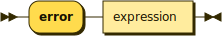

```
errorStatement
         ::= 'error' expression
```

referenced by:

* delimitedStatement

**raiseStatement:**

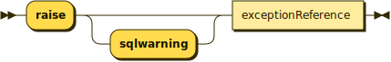

```
raiseStatement
         ::= 'raise' 'sqlwarning'? exceptionReference
```

referenced by:

* delimitedStatement

**exceptionReference:**

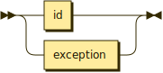

```
exceptionReference
         ::= id
           | exception
```

referenced by:

* exception
* raiseStatement

**exception:**

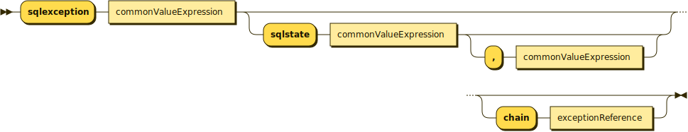

```
exception
         ::= 'sqlexception' commonValueExpression ( 'sqlstate' commonValueExpression ( ',' commonValueExpression )? )? ( 'chain' exceptionReference )?
```

referenced by:

* assignStatementOperand
* exceptionReference

**statement:**

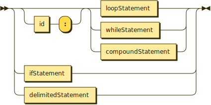

```
statement
         ::= ( id ':' )? ( loopStatement | whileStatement | compoundStatement )
           | ifStatement
           | delimitedStatement
```

referenced by:

* alter
* alterProcedure
* compoundStatement
* createDDLProcedure
* createProcedure
* forEachRowTriggerAction
* ifStatement
* loopStatement
* procedureBodyCommand
* whileStatement

**delimitedStatement:**

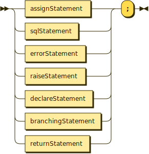

```
delimitedStatement
         ::= ( assignStatement | sqlStatement | errorStatement | raiseStatement | declareStatement | branchingStatement | returnStatement ) ';'
```

referenced by:

* statement

**compoundStatement:**

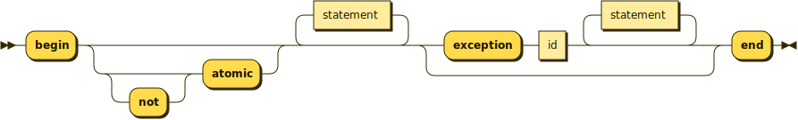

```
compoundStatement
         ::= 'begin' ( 'not'? 'atomic' )? statement* ( 'exception' id statement* )? 'end'
```

referenced by:

* statement
* userCommand

**branchingStatement:**

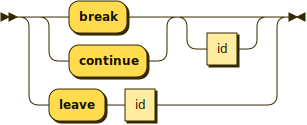

```
branchingStatement
         ::= ( 'break' | 'continue' ) id?
           | 'leave' id
```

referenced by:

* delimitedStatement

**returnStatement:**

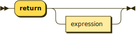

```
returnStatement
         ::= 'return' expression?
```

referenced by:

* delimitedStatement

**whileStatement:**

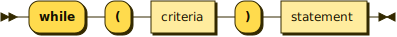

```
whileStatement
         ::= 'while' '(' criteria ')' statement
```

referenced by:

* statement

**loopStatement:**

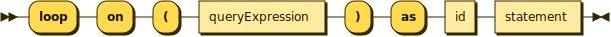

```
loopStatement
         ::= 'loop' 'on' '(' queryExpression ')' 'as' id statement
```

referenced by:

* statement

**ifStatement:**

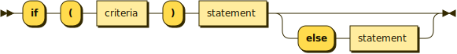

```
ifStatement
         ::= 'if' '(' criteria ')' statement ( 'else' statement )?
```

referenced by:

* statement

**declareStatement:**

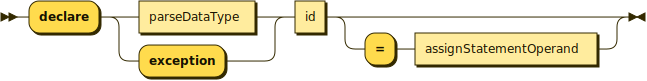

```
declareStatement
         ::= 'declare' ( parseDataType | 'exception' ) id ( '=' assignStatementOperand )?
```

referenced by:

* delimitedStatement

**assignStatement:**

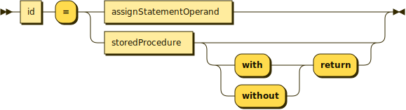

```
assignStatement
         ::= id '=' ( assignStatementOperand | storedProcedure ( ( 'with' | 'without' ) 'return' )? )
```

referenced by:

* delimitedStatement

**assignStatementOperand:**

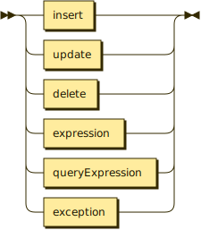

```
assignStatementOperand
         ::= insert
           | update
           | delete
           | expression
           | queryExpression
           | exception
```

referenced by:

* assignStatement
* declareStatement

**sqlStatement:**

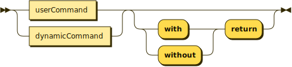

```
sqlStatement
         ::= ( userCommand | dynamicCommand ) ( ( 'with' | 'without' ) 'return' )?
```

referenced by:

* delimitedStatement

**createProcedure:**

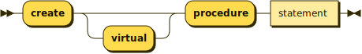

```
createProcedure
         ::= 'create' 'virtual'? 'procedure' statement
```

referenced by:

* command

**procedureBodyCommand:**

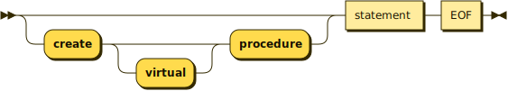

```
procedureBodyCommand
         ::= ( 'create' 'virtual'? 'procedure' )? statement EOF
```

**dynamicCommand:**

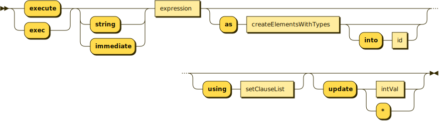

```
dynamicCommand
         ::= ( 'execute' | 'exec' ) ( 'string' | 'immediate' )? expression ( 'as' createElementsWithTypes ( 'into' id )? )? ( 'using' setClauseList )? ( 'update' ( intVal | '*' ) )?
```

referenced by:

* sqlStatement

**setClauseList:**

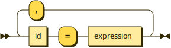

```
setClauseList
         ::= id '=' expression ( ',' id '=' expression )*
```

referenced by:

* dynamicCommand
* update

**createElementsWithTypes:**

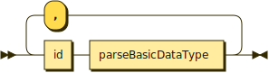

```
createElementsWithTypes
         ::= id parseBasicDataType ( ',' id parseBasicDataType )*
```

referenced by:

* arrayTable
* dynamicCommand

**callableStatement:**

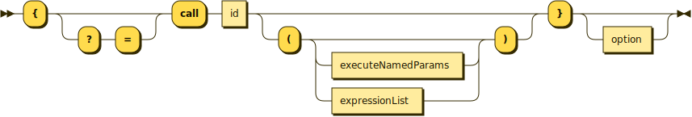

```
callableStatement
         ::= '{' ( '?' '=' )? 'call' id ( '(' ( executeNamedParams | expressionList )? ')' )? '}' option?
```

referenced by:

* command

**storedProcedure:**

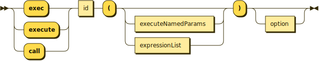

```
storedProcedure
         ::= ( 'exec' | 'execute' | 'call' ) id '(' ( executeNamedParams | expressionList )? ')' option?
```

referenced by:

* assignStatement
* subquery
* subqueryFromClause
* userCommand

**executeNamedParams:**

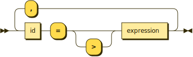

```
executeNamedParams
         ::= id '=' '>'? expression ( ',' id '=' '>'? expression )*
```

referenced by:

* callableStatement
* storedProcedure

**insert:**

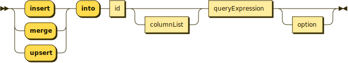

```
insert   ::= ( 'insert' | 'merge' | 'upsert' ) 'into' id columnList? queryExpression option?
```

referenced by:

* assignStatementOperand
* userCommand

**expressionList:**


```
expressionList
         ::= expression ( ',' expression )*
```

referenced by:

* callableStatement
* constraint
* function
* groupBy
* queryPrimary
* storedProcedure
* windowSpecification

**update:**

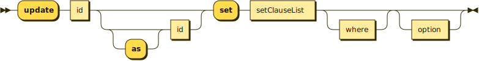

```
update   ::= 'update' id ( 'as'? id )? 'set' setClauseList where? option?
```

referenced by:

* assignStatementOperand
* userCommand

**delete:**

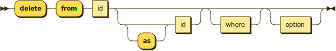

```
delete   ::= 'delete' 'from' id ( 'as'? id )? where? option?
```

referenced by:

* assignStatementOperand
* userCommand

**queryExpression:**

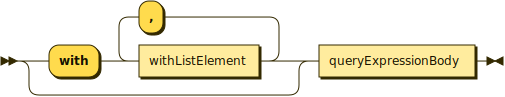

```
queryExpression
         ::= ( 'with' withListElement ( ',' withListElement )* )? queryExpressionBody
```

referenced by:

* alter
* alterTable
* arrayExpression
* assignStatementOperand
* createView
* insert
* loopStatement
* subquery
* subqueryFromClause
* userCommand
* withListElement

**withListElement:**

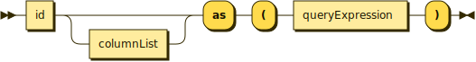

```
withListElement
         ::= id columnList? 'as' '(' queryExpression ')'
```

referenced by:

* queryExpression

**queryExpressionBody:**

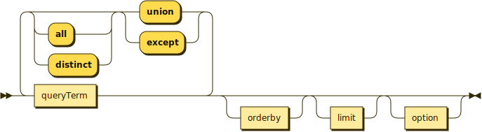

```
queryExpressionBody
         ::= queryTerm ( ( 'union' | 'except' ) ( 'all' | 'distinct' )? queryTerm )* orderby? limit? option?
```

referenced by:

* queryExpression
* queryPrimary

**queryTerm:**

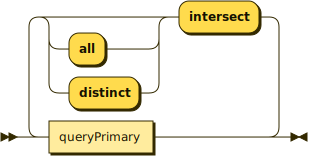

```
queryTerm
         ::= queryPrimary ( 'intersect' ( 'all' | 'distinct' )? queryPrimary )*
```

referenced by:

* queryExpressionBody

**queryPrimary:**

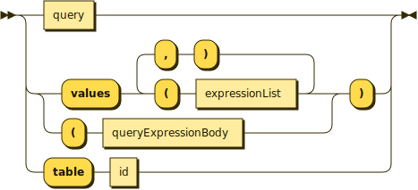

```
queryPrimary
         ::= query
           | ( 'values' '(' expressionList ( ')' ',' '(' expressionList )* | '(' queryExpressionBody ) ')'
           | 'table' id
```

referenced by:

* queryTerm

**query:**

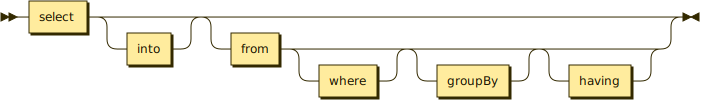

```
query    ::= select into? ( from where? groupBy? having? )?
```

referenced by:

* queryPrimary

**into:**

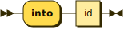

```
into     ::= 'into' id
```

referenced by:

* query

**select:**


```
select   ::= 'select' ( 'all' | 'distinct' )? ( '*' | selectSymbol ( ',' selectSymbol )* )
```

referenced by:

* query

**selectSymbol:**

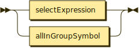

```
selectSymbol
         ::= selectExpression
           | allInGroupSymbol
```

referenced by:

* select

**selectExpression:**

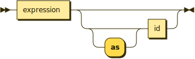

```
selectExpression
         ::= expression ( 'as'? id )?
```

referenced by:

* selectSymbol

**derivedColumn:**

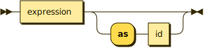

```
derivedColumn
         ::= expression ( 'as' id )?
```

referenced by:

* derivedColumnList
* objectTable
* queryString
* textAgg
* xmlAttributes
* xmlExists
* xmlQuery
* xmlTable

**allInGroupSymbol:**


```
allInGroupSymbol
         ::= ALL_IN_GROUP
```

referenced by:

* selectSymbol

**orderedAgg:**


```
orderedAgg
         ::= ( 'xmlagg' | 'array_agg' | 'jsonarray_agg' ) '(' expression orderby? ')'
```

referenced by:

* unescapedFunction

**textAgg:**


```
textAgg  ::= 'textagg' '(' 'for'? derivedColumn ( ',' derivedColumn )* ( 'delimiter' charVal )? ( 'quote' charVal | 'no' 'quote' )? 'header'? ( 'encoding' id )? orderby? ')'
```

referenced by:

* unescapedFunction

**aggregateSymbol:**


```
aggregateSymbol
         ::= ( ( 'count' | 'count_big' ) '(' '*' | ( 'count' | 'count_big' | 'sum'
                  | 'avg' | 'min' | 'max' | 'every' | 'stddev_pop' | 'stddev_samp' | 'var_samp' | 'var_pop'
                  | 'some' | 'any' ) '(' ( 'distinct' | 'all' )? expression ) ')'
```

referenced by:

* unescapedFunction

**analyticAggregateSymbol:**


```
analyticAggregateSymbol
         ::= ( 'row_number' | 'rank' | 'dense_rank' | 'percent_rank' | 'cume_dist'
                  ) '(' ')'
```

referenced by:

* unescapedFunction

**filterClause:**


```
filterClause
         ::= 'filter' '(' 'where' criteria ')'
```

referenced by:

* function
* unescapedFunction

**from:**


```
from     ::= 'from' tableReference ( ',' tableReference )*
```

referenced by:

* query

**tableReference:**


```
tableReference
         ::= ESCAPEDJOIN joinedTable '}'
           | joinedTable
```

referenced by:

* from
* qualifiedJoin

**joinedTable:**


```
joinedTable
         ::= tablePrimary ( crossJoin | qualifiedJoin )*
```

referenced by:

* tablePrimary
* tableReference

**crossJoin:**


```
crossJoin
         ::= ( 'cross' | 'union' ) 'join' tablePrimary
```

referenced by:

* joinedTable

**qualifiedJoin:**


```
qualifiedJoin
         ::= ( ( 'right' | 'left' | 'full' ) 'outer'? | 'inner' )? 'join' tableReference 'on' criteria
```

referenced by:

* joinedTable

**tablePrimary:**


```
tablePrimary
         ::= ( textTable | arrayTable | jsonTable | xmlTable | objectTable | unaryFromClause | subqueryFromClause | '(' joinedTable ')' ) ( 'makedep' makedepOptions | 'makenotdep' )? ( 'makeind' makedepOptions )?
```

referenced by:

* crossJoin
* joinedTable

**makedepOptions:**


```
makedepOptions
         ::= ( '(' ( 'max' ':' intVal )? ( 'no'? 'join' )? ')' )?
```

referenced by:

* option
* tablePrimary

**xmlSerialize:**


```
xmlSerialize
         ::= 'xmlserialize' '(' ( 'document' | 'content' )? expression ( 'as' ( 'string' | 'varchar' | 'clob' | 'varbinary' | 'blob' ) )? ( 'encoding' id )? ( 'version' stringVal )? ( ( 'including' | 'excluding' ) 'xmldeclaration' )? ')'
```

referenced by:

* function

**arrayTable:**


```
arrayTable
         ::= 'arraytable' '(' ( 'row' | 'rows' )? valueExpressionPrimary 'columns' createElementsWithTypes ')' 'as'? id
```

referenced by:

* tablePrimary

**jsonTable:**


```
jsonTable
         ::= 'jsontable' '(' valueExpressionPrimary ',' stringVal ( ',' ( 'true' | 'false' ) )? 'columns' jsonColumn ( ',' jsonColumn )* ')' 'as'? id
```

referenced by:

* tablePrimary

**jsonColumn:**


```
jsonColumn
         ::= id ( 'for' 'ordinality' | parseBasicDataType ( 'path' stringVal )? )
```

referenced by:

* jsonTable

**textTable:**


```
textTable
         ::= 'texttable' '(' commonValueExpression ( 'selector' stringVal )? 'columns' textColumn ( ',' textColumn )* ( 'no' 'row' 'delimiter' | 'row' 'delimiter' charVal )? ( 'delimiter' charVal )? ( ( 'escape' | 'quote' ) charVal )? ( 'header' intVal? )? ( 'skip' intVal )? ( 'no' 'trim' )? ')' 'as'? id
```

referenced by:

* tablePrimary

**textColumn:**


```
textColumn
         ::= id ( 'for' 'ordinality' | ( 'header' stringVal )? parseBasicDataType ( 'width' intVal ( 'no' 'trim' )? )? ( 'selector' stringVal intVal )? )
```

referenced by:

* textTable

**xmlExists:**


```
xmlExists
         ::= 'xmlexists' '(' ( xmlNamespaces ',' )? stringVal ( 'passing' derivedColumn ( ',' derivedColumn )* )? ')'
```

referenced by:

* booleanPrimary

**xmlQuery:**


```
xmlQuery ::= 'xmlquery' '(' ( xmlNamespaces ',' )? stringVal ( 'passing' derivedColumn ( ',' derivedColumn )* )? ( ( 'null' | 'empty' ) 'on' 'empty' )? ')'
```

referenced by:

* function

**objectTable:**


```
objectTable
         ::= 'objecttable' '(' ( 'language' stringVal )? stringVal ( 'passing' derivedColumn ( ',' derivedColumn )* )? 'columns' objectColumn ( ',' objectColumn )* ')' 'as'? id
```

referenced by:

* tablePrimary

**objectColumn:**


```
objectColumn
         ::= id parseBasicDataType stringVal ( 'default' expression )?
```

referenced by:

* objectTable

**xmlTable:**


```
xmlTable ::= 'xmltable' '(' ( xmlNamespaces ',' )? stringVal ( 'passing' derivedColumn ( ',' derivedColumn )* )? ( 'columns' xmlColumn ( ',' xmlColumn )* )? ')' 'as'? id
```

referenced by:

* tablePrimary

**xmlColumn:**


```
xmlColumn
         ::= id ( 'for' 'ordinality' | parseBasicDataType ( 'default' expression )? ( 'path' stringVal )? )
```

referenced by:

* xmlTable

**intVal:**


```
intVal   ::= UNSIGNEDINTEGER
```

referenced by:

* dynamicCommand
* function
* grant
* intParam
* makedepOptions
* parameterReference
* parseDataTypePrimary
* textColumn
* textTable
* windowFrameBound

**subqueryFromClause:**


```
subqueryFromClause
         ::= ( 'table' | 'lateral' )? '(' ( queryExpression | storedProcedure ) ')' 'as'? id
```

referenced by:

* tablePrimary

**unaryFromClause:**


```
unaryFromClause
         ::= id ( 'as'? id )?
```

referenced by:

* tablePrimary

**where:**


```
where    ::= 'where' criteria
```

referenced by:

* delete
* query
* update

**criteria:**


```
criteria ::= compoundCritOr
```

referenced by:

* createPolicy
* expression
* filterClause
* grant
* having
* ifStatement
* qualifiedJoin
* searchedCaseExpression
* where
* whileStatement

**compoundCritOr:**


```
compoundCritOr
         ::= compoundCritAnd ( 'or' compoundCritAnd )*
```

referenced by:

* criteria

**compoundCritAnd:**


```
compoundCritAnd
         ::= notCrit ( 'and' notCrit )*
```

referenced by:

* compoundCritOr

**notCrit:**


```
notCrit  ::= 'not'? booleanPrimary
```

referenced by:

* compoundCritAnd

**booleanPrimary:**


```
booleanPrimary
         ::= commonValueExpression ( betweenCrit | matchCrit | regexMatchCrit | setCrit | isNullCrit | subqueryCompareCriteria | compareCrit | isDistinct )?
           | existsCriteria
           | xmlExists
```

referenced by:

* notCrit

**operator:**


```
operator ::= '='
           | '<>'
           | '!='
           | '<'
           | '<='
           | '>'
           | '>='
```

referenced by:

* compareCrit
* subqueryCompareCriteria

**isDistinct:**


```
isDistinct
         ::= 'is' 'not'? 'distinct' 'from' commonValueExpression
```

referenced by:

* booleanPrimary

**compareCrit:**


```
compareCrit
         ::= operator commonValueExpression
```

referenced by:

* booleanPrimary

**subquery:**


```
subquery ::= '(' ( queryExpression | storedProcedure ) ')'
```

referenced by:

* existsCriteria
* setCrit
* subqueryCompareCriteria
* unsignedValueExpressionPrimary

**subqueryCompareCriteria:**


```
subqueryCompareCriteria
         ::= operator ( 'any' | 'some' | 'all' ) ( subquery | '(' expression ')' )
```

referenced by:

* booleanPrimary

**matchCrit:**


```
matchCrit
         ::= 'not'? ( 'like' | 'similar' 'to' ) commonValueExpression ( 'escape' charVal | '{' 'escape' charVal '}' )?
```

referenced by:

* booleanPrimary

**regexMatchCrit:**


```
regexMatchCrit
         ::= 'not'? 'like_regex' commonValueExpression
```

referenced by:

* booleanPrimary

**charVal:**


```
charVal  ::= stringVal
```

referenced by:

* matchCrit
* textAgg
* textTable

**betweenCrit:**


```
betweenCrit
         ::= 'not'? 'between' commonValueExpression 'and' commonValueExpression
```

referenced by:

* booleanPrimary

**isNullCrit:**


```
isNullCrit
         ::= 'is' 'not'? 'null'
```

referenced by:

* booleanPrimary

**setCrit:**


```
setCrit  ::= 'not'? 'in' ( subquery | '(' commonValueExpression ( ',' commonValueExpression )* ')' )
```

referenced by:

* booleanPrimary

**existsCriteria:**


```
existsCriteria
         ::= 'exists' subquery
```

referenced by:

* booleanPrimary

**groupBy:**


```
groupBy  ::= 'group' 'by' ( 'ROLLUP' '(' expressionList ')' | expressionList )
```

referenced by:

* query

**having:**


```
having   ::= 'having' criteria
```

referenced by:

* query

**orderby:**


```
orderby  ::= 'order' 'by' sortSpecification ( ',' sortSpecification )*
```

referenced by:

* function
* orderedAgg
* queryExpressionBody
* textAgg
* windowSpecification

**sortSpecification:**


```
sortSpecification
         ::= sortKey ( 'asc' | 'desc' )? ( 'nulls' ( 'first' | 'last' ) )?
```

referenced by:

* orderby

**sortKey:**


```
sortKey  ::= expression
```

referenced by:

* sortSpecification

**intParam:**


```
intParam ::= intVal
           | unsignedValueExpressionPrimary
```

referenced by:

* fetchLimit
* limit

**limit:**


```
limit    ::= 'limit' intParam ( ( ',' | 'offset' ) intParam )?
           | 'offset' intParam ( 'row' | 'rows' ) fetchLimit?
           | fetchLimit
```

referenced by:

* queryExpressionBody

**fetchLimit:**


```
fetchLimit
         ::= 'fetch' ( 'first' | 'next' ) intParam? ( 'row' | 'rows' ) 'only'
```

referenced by:

* limit

**option:**


```
option   ::= 'option' ( ( 'makedep' | 'makeind' ) id makedepOptions ( ',' id makedepOptions )* | 'makenotdep' id ( ',' id )* | 'nocache' ( id ( ',' id )* )? )*
```

referenced by:

* callableStatement
* delete
* insert
* queryExpressionBody
* storedProcedure
* update

**expression:**


```
expression
         ::= criteria
```

referenced by:

* aggregateSymbol
* arrayExpression
* assignStatementOperand
* caseExpression
* derivedColumn
* dynamicCommand
* errorStatement
* executeNamedParams
* expressionList
* function
* nestedExpression
* objectColumn
* orderedAgg
* postCreateColumn
* procedureParameter
* queryString
* returnStatement
* searchedCaseExpression
* selectExpression
* setClauseList
* sortKey
* subqueryCompareCriteria
* unescapedFunction
* xmlColumn
* xmlElement
* xmlParse
* xmlSerialize

**commonValueExpression:**


```
commonValueExpression
         ::= plusExpression ( ( '&&' | '||' ) plusExpression )*
```

referenced by:

* betweenCrit
* booleanPrimary
* compareCrit
* exception
* function
* isDistinct
* matchCrit
* regexMatchCrit
* setCrit
* textTable

**plusExpression:**


```
plusExpression
         ::= timesExpression ( plusMinus timesExpression )*
```

referenced by:

* commonValueExpression
* valueExpressionPrimary

**plusMinus:**


```
plusMinus
         ::= '+'
           | '-'
```

referenced by:

* alterChildOptionPair
* alterOptionPair
* optionPair
* plusExpression
* valueExpressionPrimary

**timesExpression:**


```
timesExpression
         ::= valueExpressionPrimary ( timesOperator valueExpressionPrimary )*
```

referenced by:

* plusExpression

**timesOperator:**


```
timesOperator
         ::= '*'
           | '/'
```

referenced by:

* timesExpression

**valueExpressionPrimary:**


```
valueExpressionPrimary
         ::= nonNumericLiteral
           | plusMinus? ( unsignedNumericLiteral | unsignedValueExpressionPrimary ( '[' plusExpression ']' )* )
```

referenced by:

* arrayTable
* jsonTable
* timesExpression

**parameterReference:**


```
parameterReference
         ::= '?'
           | '$' intVal
```

referenced by:

* unsignedValueExpressionPrimary

**unescapedFunction:**


```
unescapedFunction
         ::= ( ( textAgg | aggregateSymbol | orderedAgg ) filterClause? | function ) windowSpecification?
           | analyticAggregateSymbol filterClause? windowSpecification
           | 'xmlcast' '(' expression 'as' parseDataType ')'
```

referenced by:

* unsignedValueExpressionPrimary

**nestedExpression:**


```
nestedExpression
         ::= '(' ( expression ( ',' expression )* )? ','? ')'
```

referenced by:

* unsignedValueExpressionPrimary

**unsignedValueExpressionPrimary:**


```
unsignedValueExpressionPrimary
         ::= parameterReference
           | ESCAPEDFUNCTION function '}'
           | unescapedFunction
           | ID
           | nonReserved
           | subquery
           | nestedExpression
           | arrayExpression
           | searchedCaseExpression
           | caseExpression
```

referenced by:

* intParam
* valueExpressionPrimary

**arrayExpression:**


```
arrayExpression
         ::= 'array' ( '[' ( expression ( ',' expression )* )? ']' | '(' queryExpression ')' )
```

referenced by:

* unsignedValueExpressionPrimary

**windowSpecification:**


```
windowSpecification
         ::= 'over' '(' ( 'partition' 'by' expressionList )? orderby? windowFrame? ')'
```

referenced by:

* unescapedFunction

**windowFrame:**


```
windowFrame
         ::= ( 'range' | 'rows' ) ( 'between' windowFrameBound 'and' )? windowFrameBound
```

referenced by:

* windowSpecification

**windowFrameBound:**


```
windowFrameBound
         ::= ( 'unbounded' | intVal ) ( 'following' | 'preceding' )
           | 'current' 'row'
```

referenced by:

* windowFrame

**caseExpression:**


```
caseExpression
         ::= 'case' expression ( 'when' expression 'then' expression )+ ( 'else' expression )? 'end'
```

referenced by:

* unsignedValueExpressionPrimary

**searchedCaseExpression:**


```
searchedCaseExpression
         ::= 'case' ( 'when' criteria 'then' expression )+ ( 'else' expression )? 'end'
```

referenced by:

* unsignedValueExpressionPrimary

**function:**


```
function ::= ( ( 'convert' '(' expression ',' | 'cast' '(' expression 'as' ) parseDataType | 'substring' '(' expression ( 'from' expression ( 'for' expression )? | ',' expressionList ) | ( 'extract' '(' ( 'year' | 'month' | 'day' | 'hour' | 'minute' | 'second' | 'quarter'
                  | 'epoch' | 'dow' | 'doy' ) 'from' | 'trim' '(' ( ( ( 'leading' | 'trailing' | 'both'
                  ) expression? | expression ) 'from' )? | ( 'timestampadd' | 'timestampdiff' ) '(' intervalType ',' expression ',' ) expression | ( ( 'to_chars' | 'to_bytes' ) '(' expression ',' stringVal | 'xmlpi' '(' 'name'? id ) ( ',' expression )? | ( 'left' | 'right' | 'char' | 'user' | 'year' | 'month' | 'hour' | 'minute'
                  | 'second' | 'xmlconcat' | 'xmlcomment' | 'xmltext' | 'translate' | 'insert' ) '('
                  expressionList? | 'position' '(' commonValueExpression 'in' commonValueExpression | 'listagg' '(' expression ( ',' stringVal )? ')' 'within' 'group' '(' orderby ) ')'
           | queryString
           | xmlParse
           | xmlElement
           | xmlForest
           | jsonObject
           | xmlSerialize
           | xmlQuery
           | id '(' ( 'all' | 'distinct' )? expressionList? orderby? ')' filterClause?
           | 'current_date' ( '(' ')' )?
           | ( 'current_timestamp' | 'current_time' ) ( '(' intVal ')' )?
           | 'session_user'
```

referenced by:

* unescapedFunction
* unsignedValueExpressionPrimary

**xmlParse:**


```
xmlParse ::= 'xmlparse' '(' ( 'document' | 'content' ) expression 'wellformed'? ')'
```

referenced by:

* function

**queryString:**


```
queryString
         ::= 'querystring' '(' expression ( ',' derivedColumn )* ')'
```

referenced by:

* function

**xmlElement:**


```
xmlElement
         ::= 'xmlelement' '(' 'name'? id ( ',' xmlNamespaces )? ( ',' xmlAttributes )? ( ',' expression )* ')'
```

referenced by:

* function

**xmlAttributes:**


```
xmlAttributes
         ::= 'xmlattributes' '(' derivedColumn ( ',' derivedColumn )* ')'
```

referenced by:

* xmlElement

**jsonObject:**


```
jsonObject
         ::= 'jsonobject' '(' derivedColumnList ')'
```

referenced by:

* function

**derivedColumnList:**


```
derivedColumnList
         ::= derivedColumn ( ',' derivedColumn )*
```

referenced by:

* jsonObject
* xmlForest

**xmlForest:**


```
xmlForest
         ::= 'xmlforest' '(' ( xmlNamespaces ',' )? derivedColumnList ')'
```

referenced by:

* function

**xmlNamespaces:**


```
xmlNamespaces
         ::= 'xmlnamespaces' '(' namespaceItem ( ',' namespaceItem )* ')'
```

referenced by:

* xmlElement
* xmlExists
* xmlForest
* xmlQuery
* xmlTable

**namespaceItem:**


```
namespaceItem
         ::= stringVal 'as' id
           | 'no' 'default'
           | 'default' stringVal
```

referenced by:

* xmlNamespaces

**parseDataTypePrimary:**


```
parseDataTypePrimary
         ::= ( 'string' | 'varchar' | 'char' | 'biginteger' | 'timestamp' | 'object'
                  | 'blob' | 'clob' | 'varbinary' ) ( '(' intVal ')' )?
           | 'boolean'
           | 'byte'
           | 'tinyint'
           | 'short'
           | 'smallint'
           | 'integer'
           | 'long'
           | 'bigint'
           | 'float'
           | 'real'
           | 'double'
           | ( 'bigdecimal' | 'decimal' ) ( '(' intVal ( ',' intVal )? ')' )?
           | 'date'
           | 'time'
           | 'json'
           | 'geometry'
           | 'geography'
           | 'xml'
```

referenced by:

* parseBasicDataType

**parseBasicDataType:**


```
parseBasicDataType
         ::= parseDataTypePrimary ( '[' ']' )*
```

referenced by:

* createElementsWithTypes
* jsonColumn
* objectColumn
* parseDataType
* tableElement
* textColumn
* xmlColumn

**parseDataType:**


```
parseDataType
         ::= parseBasicDataType
           | ( ID | basicNonReserved ) ( '[' ']' )*
```

referenced by:

* alterColumn
* createColumn
* createDDLProcedure
* createDomain
* createViewColumn
* declareStatement
* function
* procedureParameter
* procedureRsColumn
* unescapedFunction

**intervalType:**


```
intervalType
         ::= 'sql_tsi_frac_second'
           | 'sql_tsi_second'
           | 'sql_tsi_minute'
           | 'sql_tsi_hour'
           | 'sql_tsi_day'
           | 'sql_tsi_week'
           | 'sql_tsi_month'
           | 'sql_tsi_quarter'
           | 'sql_tsi_year'
```

referenced by:

* function

**nonNumericLiteral:**


```
nonNumericLiteral
         ::= ( 'date' | 'time' | 'timestamp' )? stringVal
           | BINARYSTRINGVAL
           | 'false'
           | 'true'
           | 'unknown'
           | 'null'
           | ESCAPEDTYPE stringVal '}'
```

referenced by:

* alterChildOptionPair
* alterOptionPair
* optionPair
* valueExpressionPrimary

**unsignedNumericLiteral:**


```
unsignedNumericLiteral
         ::= UNSIGNEDINTEGER
           | FLOATVAL
           | DECIMALVAL
```

referenced by:

* alterChildOptionPair
* alterOptionPair
* optionPair
* valueExpressionPrimary

**parseMetadata:**


```
parseMetadata
         ::= ddlStmt? ( ';' ddlStmt? )* EOF
```

**ddlStmt:**


```
ddlStmt  ::= createDDLProcedure* ( createTable ( createTable | createDDLProcedure )? | createNameSpace | alterStatement | createTrigger | createDomain | createServer | createRole | dropRole | grant | revokeGrant | createPolicy | dropPolicy | dropServer | dropTableView | importSchema | importDatabase | createDatabase | useDatabase | dropSchema | useSchema | createSchema | createDDLProcedure | createDataWrapper | dropDataWrapper | dropProcedure )
```

referenced by:

* parseMetadata

**createNameSpace:**


```
createNameSpace
         ::= 'set' 'namespace' stringVal 'as' id
```

referenced by:

* ddlStmt

**createDatabase:**


```
createDatabase
         ::= 'create' 'database' id ( 'version' stringVal )? optionsClause?
```

referenced by:

* ddlStmt

**useDatabase:**


```
useDatabase
         ::= 'use' 'database' id ( 'version' stringVal )?
```

referenced by:

* ddlStmt

**createSchema:**


```
createSchema
         ::= 'create' ( 'virtual' | 'foreign' )? 'schema' id ( 'server' identifierList )? optionsClause?
```

referenced by:

* ddlStmt

**dropSchema:**


```
dropSchema
         ::= 'drop' ( 'virtual' | 'foreign' )? 'schema' id
```

referenced by:

* ddlStmt

**useSchema:**


```
useSchema
         ::= 'set' 'schema' id
```

referenced by:

* ddlStmt

**createDomain:**


```
createDomain
         ::= 'create' 'domain' ( ID | basicNonReserved ) 'as'? parseDataType ( 'not' 'null' )?
```

referenced by:

* ddlStmt

**createDataWrapper:**


```
createDataWrapper
         ::= 'create' 'foreign' ( 'data' 'wrapper' | 'translator' ) unqualifiedId ( 'type' id optionsClause? )?
```

referenced by:

* ddlStmt

**dropDataWrapper:**


```
dropDataWrapper
         ::= 'drop' 'foreign' ( 'data' 'wrapper' | 'translator' ) id
```

referenced by:

* ddlStmt

**createRole:**


```
createRole
         ::= 'create' 'role' unqualifiedId ( 'with' readWith )?
```

referenced by:

* ddlStmt

**readWith:**


```
readWith ::= 'any' 'authenticated'
           | ( 'jaas' | 'foreign' ) 'role' identifierList
```

referenced by:

* createRole

**dropRole:**


```
dropRole ::= 'drop' 'role' id
```

referenced by:

* ddlStmt

**createPolicy:**


```
createPolicy
         ::= 'create' 'policy' id 'on' ( id ( 'for' ( 'all' | ( 'select' | 'insert' | 'update' | 'delete' ) ( ',' ( 'select'
                  | 'insert' | 'update' | 'delete' ) )* ) )? | 'procedure' id ( 'for' 'all' )? ) 'to' id 'using' '(' criteria ')'
```

referenced by:

* ddlStmt

**dropPolicy:**


```
dropPolicy
         ::= 'drop' 'policy' id 'on' 'procedure'? id 'to' id
```

referenced by:

* ddlStmt

**grant:**


```
grant    ::= 'grant' ( ( readGrantTypes ( ',' readGrantTypes )* )? 'on' ( ( 'table' | 'procedure' ) id ( 'condition' ( 'not'? 'constraint' )? stringVal )? | ( 'function' | 'schema' ) id | 'column' id ( 'mask' ( 'order' intVal )? stringVal )? ( 'condition' ( criteria | stringVal ) )? ) | 'all' 'privileges' | 'temporary' 'table' | 'usage' 'on' 'language' id ) 'to' id
```

referenced by:

* ddlStmt

**revokeGrant:**


```
revokeGrant
         ::= 'REVOKE' ( ( readGrantTypes ( ',' readGrantTypes )* )? 'on' ( ( 'table' | 'procedure' ) id 'condition'? | ( 'function' | 'schema' ) id | 'column' id 'mask'? ) | 'all' 'privileges' | 'temporary' 'table' | 'usage' 'on' 'language' id ) 'from' id
```

referenced by:

* ddlStmt

**createServer:**


```
createServer
         ::= 'create' 'server' unqualifiedId ( 'type' stringVal )? ( 'version' stringVal )? 'foreign' ( 'data' 'wrapper' | 'translator' ) unqualifiedId optionsClause?
```

referenced by:

* ddlStmt

**dropServer:**


```
dropServer
         ::= 'drop' 'server' id
```

referenced by:

* ddlStmt

**createDDLProcedure:**


```
createDDLProcedure
         ::= 'create' ( 'virtual' | 'foreign' )? ( 'procedure' | 'function' ) unqualifiedId '(' ( procedureParameter ( ',' procedureParameter )* )? ')' ( 'returns' optionsClause? ( 'table'? '(' procedureRsColumn ( ',' procedureRsColumn )* ')' | parseDataType ) )? optionsClause? ( 'as' statement )?
```

referenced by:

* ddlStmt

**dropProcedure:**


```
dropProcedure
         ::= 'drop' ( 'virtual' | 'foreign' )? ( 'procedure' | 'function' ) id
```

referenced by:

* ddlStmt

**procedureParameter:**


```
procedureParameter
         ::= ( 'in' | 'out' | 'inout' | 'variadic' )? id parseDataType ( 'not' 'null' )? 'result'? ( 'default' expression )? optionsClause?
```

referenced by:

* createDDLProcedure

**procedureRsColumn:**


```
procedureRsColumn
         ::= id parseDataType ( 'not' 'null' )? optionsClause?
```

referenced by:

* createDDLProcedure

**createTable:**


```
createTable
         ::= 'create' ( createView | createForeignOrGloablTable )
```

referenced by:

* ddlStmt

**createForeignOrGloablTable:**


```
createForeignOrGloablTable
         ::= ( 'foreign' | 'global' 'temporary' ) 'table' unqualifiedId createTableBody
```

referenced by:

* createTable

**createView:**


```
createView
         ::= 'virtual'? 'view' unqualifiedId ( createViewBody | optionsClause )? 'as' queryExpression
```

referenced by:

* createTable

**dropTableView:**


```
dropTableView
         ::= 'drop' ( ( 'foreign' | 'global' 'temporary' ) 'table' | 'virtual'? 'view'
                  ) id
```

referenced by:

* ddlStmt

**createForeignTempTable:**


```
createForeignTempTable
         ::= 'create' 'local'? 'foreign' 'temporary' 'table' unqualifiedId createTableBody 'on' id
```

referenced by:

* userCommand

**createTableBody:**


```
createTableBody
         ::= '(' createColumn ( ',' ( tableConstraint | createColumn ) )* ')' optionsClause?
```

referenced by:

* createForeignOrGloablTable
* createForeignTempTable

**createViewBody:**


```
createViewBody
         ::= '(' createViewColumn ( ',' ( tableConstraint | createViewColumn ) )* ')' optionsClause?
```

referenced by:

* createView

**tableConstraint:**


```
tableConstraint
         ::= ( 'constraint' id )? ( primaryKey | constraint | foreignKey ) optionsClause?
```

referenced by:

* alterAddConstraint
* createTableBody
* createViewBody

**foreignKey:**


```
foreignKey
         ::= 'foreign' 'key' columnList 'REFERENCES' id columnList?
```

referenced by:

* tableConstraint

**primaryKey:**


```
primaryKey
         ::= 'primary' 'key' columnList
```

referenced by:

* tableConstraint

**constraint:**


```
constraint
         ::= ( 'unique' | 'accesspattern' ) columnList
           | 'index' '(' expressionList ')'
```

referenced by:

* tableConstraint

**columnList:**


```
columnList
         ::= '(' id ( ',' id )* ')'
```

referenced by:

* constraint
* createTempTable
* foreignKey
* insert
* primaryKey
* withListElement

**createColumn:**


```
createColumn
         ::= id ( 'serial' | parseDataType ( 'not' 'null' )? 'auto_increment'? ) postCreateColumn
```

referenced by:

* alterAddColumn
* createTableBody

**createViewColumn:**


```
createViewColumn
         ::= id ( 'serial' | parseDataType ( 'not' 'null' )? 'auto_increment'? )? postCreateColumn
```

referenced by:

* createViewBody

**postCreateColumn:**


```
postCreateColumn
         ::= inlineConstraint? ( 'default' expression )? optionsClause?
```

referenced by:

* createColumn
* createViewColumn

**inlineConstraint:**


```
inlineConstraint
         ::= 'primary' 'key'
           | 'unique'
           | 'index'
```

referenced by:

* postCreateColumn

**optionsClause:**


```
optionsClause
         ::= 'options' '(' optionPair ( ',' optionPair )* ')'
```

referenced by:

* createDDLProcedure
* createDataWrapper
* createDatabase
* createSchema
* createServer
* createTableBody
* createView
* createViewBody
* importSchema
* postCreateColumn
* procedureParameter
* procedureRsColumn
* tableConstraint

**optionPair:**


```
optionPair
         ::= id ( nonNumericLiteral | plusMinus? unsignedNumericLiteral )
```

referenced by:

* optionsClause

**alterOptionPair:**


```
alterOptionPair
         ::= id ( nonNumericLiteral | plusMinus? unsignedNumericLiteral )
```

referenced by:

* addSetOption

**alterStatement:**


```
alterStatement
         ::= 'alter' ( alterTable | alterProcedure | alterTrigger | alterServer | alterTranslator | alterDatabase )
```

referenced by:

* ddlStmt

**alterTable:**


```
alterTable
         ::= ( 'virtual'? 'view' | 'foreign'? 'table' ) id ( 'as' queryExpression | alterAddColumn | alterAddConstraint | alterOptionsList | alterDropColumn | 'alter' 'column' alterColumn | 'rename' ( alterRenameTable | 'column' alterRenameColumn ) )
```

referenced by:

* alterStatement

**alterRenameTable:**


```
alterRenameTable
         ::= 'to' id
```

referenced by:

* alterTable

**alterAddConstraint:**


```
alterAddConstraint
         ::= 'add' tableConstraint
```

referenced by:

* alterTable

**alterAddColumn:**


```
alterAddColumn
         ::= 'add' 'column' createColumn
```

referenced by:

* alterTable

**alterDropColumn:**


```
alterDropColumn
         ::= 'drop' 'column' id
```

referenced by:

* alterTable

**alterColumn:**


```
alterColumn
         ::= id ( 'type' ( 'serial' | parseDataType ( 'not' 'null' )? 'auto_increment'? ) | alterChildOptionsList )
```

referenced by:

* alterProcedure
* alterTable

**alterRenameColumn:**


```
alterRenameColumn
         ::= id 'to' id
```

referenced by:

* alterProcedure
* alterTable

**alterProcedure:**


```
alterProcedure
         ::= ( 'virtual' | 'foreign' )? 'procedure' id ( 'as' statement | alterOptionsList | 'alter' 'parameter' alterColumn | 'rename' 'parameter' alterRenameColumn )
```

referenced by:

* alterStatement

**alterTrigger:**


```
alterTrigger
         ::= 'trigger' 'on' id 'instead' 'of' ( 'insert' | 'update' | 'delete' ) ( 'as' forEachRowTriggerAction | 'enabled' | 'disabled' )
```

referenced by:

* alterStatement

**alterServer:**


```
alterServer
         ::= 'server' id alterOptionsList
```

referenced by:

* alterStatement

**alterTranslator:**


```
alterTranslator
         ::= ( 'data' 'wrapper' | 'translator' ) id alterOptionsList
```

referenced by:

* alterStatement

**alterDatabase:**


```
alterDatabase
         ::= 'database' id alterOptionsList
```

referenced by:

* alterStatement

**alterOptionsList:**


```
alterOptionsList
         ::= 'options' '(' ( addSetOption | dropOption ) ( ',' ( addSetOption | dropOption ) )* ')'
```

referenced by:

* alterDatabase
* alterProcedure
* alterServer
* alterTable
* alterTranslator

**dropOption:**


```
dropOption
         ::= 'drop' id
```

referenced by:

* alterOptionsList

**addSetOption:**


```
addSetOption
         ::= ( 'add' | 'set' ) alterOptionPair
```

referenced by:

* alterOptionsList

**alterChildOptionsList:**


```
alterChildOptionsList
         ::= 'options' '(' ( addSetChildOption | dropChildOption ) ( ',' ( addSetChildOption | dropChildOption ) )* ')'
```

referenced by:

* alterColumn

**dropChildOption:**


```
dropChildOption
         ::= 'drop' id
```

referenced by:

* alterChildOptionsList

**addSetChildOption:**


```
addSetChildOption
         ::= ( 'add' | 'set' ) alterChildOptionPair
```

referenced by:

* alterChildOptionsList

**alterChildOptionPair:**


```
alterChildOptionPair
         ::= id ( nonNumericLiteral | plusMinus? unsignedNumericLiteral )
```

referenced by:

* addSetChildOption

**importSchema:**


```
importSchema
         ::= 'import' ( 'foreign' 'schema' id )? 'from' ( 'server' | 'repository' ) id 'into' id optionsClause?
```

referenced by:

* ddlStmt

**importDatabase:**


```
importDatabase
         ::= 'import' 'database' id 'version' stringVal ( 'with' 'access' 'control' )?
```

referenced by:

* ddlStmt

**identifierList:**


```
identifierList
         ::= id ( ',' id )*
```

referenced by:

* createSchema
* readWith

**readGrantTypes:**


```
readGrantTypes
         ::= 'select'
           | 'insert'
           | 'update'
           | 'delete'
           | 'execute'
           | 'alter'
           | 'drop'
```

referenced by:

* grant
* revokeGrant

**LINE_COMMENT:**


```
LINE_COMMENT
         ::= '--' [^#xD#xA]*
```

**ALL_IN_GROUP:**


```
ALL_IN_GROUP
         ::= ID '.' '*'
```

referenced by:

* allInGroupSymbol

**ID:**


```
ID       ::= QUOTED_ID ( '.' QUOTED_ID )*
```

referenced by:

* ALL_IN_GROUP
* createDomain
* id
* parseDataType
* unqualifiedId
* unsignedValueExpressionPrimary

**QUOTED_ID:**


```
QUOTED_ID
         ::= ID_PART
           | '"' ( '""' | [^"] )+ '"'
```

referenced by:

* ID

**ID_PART:**


```
ID_PART  ::= ( '_' | '@' | '#' | LETTER ) ( LETTER | '_' | DIGIT )*
```

referenced by:

* QUOTED_ID

**ESCAPEDFUNCTION:**


```
ESCAPEDFUNCTION
         ::= '{' 'fn'
```

referenced by:

* unsignedValueExpressionPrimary

**ESCAPEDJOIN:**


```
ESCAPEDJOIN
         ::= '{' 'oj'
```

referenced by:

* tableReference

**ESCAPEDTYPE:**


```
ESCAPEDTYPE
         ::= '{' ( 'd' | 't' | 'ts' | 'b' )
```

referenced by:

* nonNumericLiteral

**DECIMALVAL:**


```
DECIMALVAL
         ::= DIGIT* '.' UNSIGNEDINTEGER
```

referenced by:

* unsignedNumericLiteral

**FLOATVAL:**


```
FLOATVAL ::= DIGIT '.' UNSIGNEDINTEGER [eE] ( '+' | '-' )? UNSIGNEDINTEGER
```

referenced by:

* unsignedNumericLiteral

**STRINGVAL:**


```
STRINGVAL
         ::= ( 'N' | 'E' )? "'" ( "''" | [^'] )* "'"
```

referenced by:

* stringVal

**LETTER:**


```
LETTER   ::= [a-zA-Z#x153-#xFFFD]
```

referenced by:

* ID_PART

**DIGIT:**


```
DIGIT    ::= [0-9]
```

referenced by:

* DECIMALVAL
* FLOATVAL
* HEXIT
* ID_PART
* UNSIGNEDINTEGER

**UNSIGNEDINTEGER:**


```
UNSIGNEDINTEGER
         ::= DIGIT+
```

referenced by:

* DECIMALVAL
* FLOATVAL
* intVal
* unsignedNumericLiteral

**BINARYSTRINGVAL:**


```
BINARYSTRINGVAL
         ::= 'X'
           | 'x' "'" ( HEXIT HEXIT )+ "'"
```

referenced by:

* nonNumericLiteral

**HEXIT:**


```
HEXIT    ::= [a-fA-F]
           | DIGIT
```

referenced by:

* BINARYSTRINGVAL

**EOF:**


```
EOF      ::= $
```

referenced by:

* command
* parseMetadata
* procedureBodyCommand
