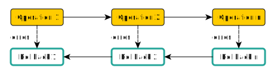

import { Callout } from 'nextra/components'

# Endpoints

Although SQL is a well-established and simple language that can be learned in just a few days, Kubling was originally designed to integrate with other systems, 
rather than being directly accessed by end users.

However, modern applications rarely interact with databases using plain SQL queries. To address this, we incorporated a mechanism similar to the way virtual databases 
are defined, allowing Kubling to expose HTTP endpoints for interacting with VDBs, schemas, and entities, offering a more flexible and accessible way to work with data.

These endpoints logic are defined using `YAML` files, parsed as [templates](/template), and registered to the engine endpoints list during initialization.
`YAML` files must be located in the [Descriptor Bundle](/Concepts/artifacts#descriptor-bundle).

Endpoints are divided into two different types: Queries and Actions.

<Callout type="info">
  The examples below assume that the functions are part of a module named `mymod`.
</Callout>

## Queries
Allow to dynamically expose services that return a collection of rows using a SQL query.<br/>
Let's break down the definition of an endpoint using the following sample:

```yaml showLineNumbers copy


---

type: sqlDirect
virtualDatabase: {{ vdb }}

neededFields:
  - namespace

query: |
  
  
    {{ "UNION ALL" | filterValWhenVarFalse(var="first", flip=true) }}
    SELECT * FROM {{ table }} WHERE metadata__namespace = '{{ namespace }}'
  
    ORDER BY clusterName
```

This endpoint returns Kubernetes Deployments of **all** clusters defined as Data Source, running in a specified namespace.

The first line just sets a value to the `vdb` variable. Although it is not really useful here since the value does not change, it allows add custom logic when
having multiple Virtual Databases.

Second line is really interesting, since we get the list of `TABLE` names, of all `SCHEMAS` whose tags **contain** `kubernetes` and `deployment`.

`sqlDirect` type (the only one supported by now), tells the engine that the `query` field contains a valid Kubling SQL query.

In the line `8`, we define the input parameter fields needed by this endpoint, only one in this case. When defined, the engine expects the request sent by the client containing
a body document, in `JSON` or `YAML` format, with values for these fields.<br/>
When the template is parsed, these fields are injected in the template context.

What we want to have as a resulting query, is just a `UNION` query that aggregates results from multiple `TABLES`. To do so, we use a 
[loop](/template#for-loop) to iterate over tables.

The `UNION ALL` keyword is placed between two `SELECT` expressions, therefore it must be omitted when printing the first `SELECT`. To achieve that, we use a 
very simple filter function called `filterValWhenVarFalse`, that returns `null` when the context variable passed as `var` param  is `false` and the actual filtered
value when it is `true`. When `flip` param is `true`, the `boolean` value is flipped each time the filter is called.<br/>
More information about filters [here](/template#filters).

### Calling a Query Endpoint
The URL for calling a query endpoint is `http[s]://[address]:8282/api/v1/query/perform/[query_name]` where `query_name` is the name of the `YAML` file (without the extension).

Example: `POST` `http://localhost:8282/api/v1/query/perform/get_all_deployments` with body as follows:
```json copy
{ "namespace": "08abb0fc-f7af-4fe8-98d4-e76729567dc8" }
```

## Actions
The purpose of actions is to define a sequence of operations that are performed across other systems, 
typically represented as entities within a VDB. In essence, **an action represents the required operations to achieve a desired upstream state, using Kubling SQL queries.**

The concept of the desired state is crucial, as Kubling's primary goal is to apply a **data-centric approach to operations**, 
ensuring consistency across various operational platforms and systems. 
However, controlling the internal state of upstream systems often relies on APIs that may not be transactional. 
For example, in Kubernetes, when a new resource descriptor is applied (create or update), 
the API only provides a promise upon receipt, not a confirmation that the resource has been fully created and is operational.

In this context, an entity defined in Kubling must remain consistent. When an `INSERT`, `UPDATE`, or `DELETE` operation is performed on an entity, 
Kubling will execute the corresponding actions on the dependent system. Assuming the upstream system will eventually fulfill the request, 
an `INSERT` on the entity will return the current upstream state, maintaining the necessary **consistency**.

Let's use the following sample:
```yaml showLineNumbers copy
# ********* SECTION 1 *********




---

# ********* SECTION 2 *********

needed:
  fields:
    - component_id
    - env
    - containers

before:
  - name: "Component must exist"
    virtualDatabase: {{ vdb }}
    entity: "app_db.COMPONENT"
    filters:
      - field: "ID"
        value: {{ component_id }}
        operation: EQUAL
    assertThat: exists
    message: "Component {{ component_id }} does no exist."

  - name: "Deployment does not yet exist"
    virtualDatabase: {{ vdb }}
    entity: "app_db.COMPONENT_DEPLOYMENT_JOIN"
    filters:
      - field: "component_id"
        value: {{ component_id }}
        operation: EQUAL
      - field: "environment"
        value: {{ env }}
        operation: "EQUAL"
    assertThat: does_not_exist
    message: "Deployment {{ componentName }} of Application {{ app_id }} environment {{ env }} already exists."

# ********* SECTION 3 *********

operations:

  - name: "namespace_insert"
    type: "insert"
    virtualDatabase: {{ vdb }}
    entity: "{{ clusterSchema }}.NAMESPACE"
    skipWhenTrue: {{ mymod__ns_exists(_context.vdb, _context.clusterSchema, _context.component_id) }}
    valueAssignments:
      - field: "metadata__name"
        value: "{{ component_id }}"
    waitUntilEffective:
      maxSeconds: 15
      checkEverySeconds: 5
      byGetting:
        fields:
          - "metadata__name"
        usingFilterFieldValuePairs:
          metadata__name: "{{ component_id }}"
          status__phase: "Active"

  - name: "deployment_insert"
    type: "insert"
    virtualDatabase: {{ vdb }}
    entity: "{{ clusterSchema }}.DEPLOYMENT"
    valueAssignments:
      - field: "identifier"
        value: "xxx"
      - field: "metadata__namespace"
        value: "{{ component_id }}"
      - field: "metadata__name"
        value: "{{ componentName }}"
      - field: "spec__template__metadata__labels"
        dataType: "json"
        value:
          mgmt.kubling.com/managed: "appmodel"
          mgmt.kubling.com/uid: {{ selectorUUID }}
      - field: "spec__selector__matchLabels"
        dataType: "json"
        value:
          mgmt.kubling.com/managed: "appmodel"
          mgmt.kubling.com/uid: {{ selectorUUID }}
      - field: "spec__template__spec__containers"
        dataType: "json"
        value:
    
          - name: {{ container.name }}
            image: {{ container.image }}
            imagePullPolicy: IfNotPresent
          
            env:
              - name: {{ envEntry.name }}
                value: {{ envEntry.value }}
          
            resources:
              requests:
                cpu: {{ container.cpuRequest }}
                memory: {{ container.memRequest }}
          
            ports:
              - containerPort: {{ port.portNumber }}
          
    
    waitUntilEffective:
      maxSeconds: 60
      checkEverySeconds: 5
      byGetting:
        fields:
          - "identifier"
        usingFilterFields:
          - "metadata__namespace"
          - "metadata__name"
        putInContextVar: newAppliedDeployment

  - name: "join_insert"
    type: "insert"
    virtualDatabase: {{ vdb }}
    entity: "app_db.COMPONENT_DEPLOYMENT_JOIN"
    valueAssignments:
      - field: "component_id"
        value: "{{ component_id }}"
      - field: "environment"
        value: "{{ env }}"
      - field: "deployment_identifier"
        value: "{{ deferValueProcessing(contextVar='newAppliedDeployment.identifier') }}"
```

To simplify understanding, we can break the action down into three sections, as noted in the code with comments.

### Section 1 (Header)
This section contains the initial variables required in the subsequent sections.<br/>
`mymod__get_k8s_component_info` and `mymod__find_best_cluster_for_deploy` are [user-defined template functions](/Modules/Functions/Template). 
The function `mymod__find_best_cluster_for_deploy` is particularly important because it returns the name of the optimal cluster schema 
where a component should be deployed, based on the rules defined within the function itself.


### Section 2 (Prerequisites)
In this section, the engine checks preconditions before performing any operations.<br/>
The `needed.fields` attribute operates similarly to `query.neededFields`, meaning the request body must contain a `JSON` object with all the necessary fields. 
Additionally, this section includes a `before` element, which defines a list of assertions. If any assertion fails, the action will return an error.

For example, the assertion `Component must exist` ensures that the component being deployed is present in the application database, thus preserving consistency. 
Behind the scenes, this assertion is translated into a Kubling SQL query that verifies the existence of the relevant records, ensuring that the deployment 
targets valid entities.

### Section 3 (Operations)

In this particular section, let's review operation by operation.

#### `namespace_insert`
This operation creates a new namespace in the selected Kubernetes cluster. 
Although the operation is idempotent, the user-defined template function `mymod__ns_exists`, which returns a `boolean` indicating whether the namespace already exists, 
is used to determine if the action should be skipped via the `skipWhenTrue` attribute.

The `valueAssignments` section specifies the list of fields and their respective values, which is translated into a standard SQL `INSERT` statement in the format: 
`INSERT INTO table_name (column1, column2, column3, ...) VALUES (value1, value2, value3, ...)`.

Finally, the `waitUntilEffective` attribute plays a crucial role. Since actions form a chain of interdependent steps (in essence, a path-like DAG), 
some nodes may rely on values computed by previous nodes or just general states. `waitUntilEffective` ensures that such dependencies are resolved by waiting until 
the previous operations are fully effective before proceeding.<br/>
The `usingFilterFieldValuePairs` attribute specifies the `WHERE` clause used to verify the effectiveness of prior operations. 
It lists the conditions in a key-value format (field name: value), ensuring the system can check the relevant data before proceeding.

#### `deployment_insert`

This operation contains, under the `valueAssignments`, a field named `spec__template__metadata__labels`, whose `dataType` is a `JSON` object.<br/>
As you can see, it is possible to pass full objects, which makes the operation easier when dealing with documents.<br/>
`spec__template__spec__containers` is also a `JSON` object but a bit more flexible. In this case, its value is built by iterating over the parameter `containers` which
is expected to be an object like:
```json
"containers": [ 
  {
    "name": "my-container",
    "image": "nginx",
    "cpuRequest": "1m",
    "memRequest": "250m",
    "env": [
      {
        "name": "env1",
        "value": "val1"
      }
    ],
    "ports": [
      {
        "portNumber": 8282
      }
    ]
  }
]
```

Also, in this case `waitUntilEffective` puts the result of `identifier` in a template context variable called `newAppliedDeployment`.

#### `join_insert`

When the template parser reads the file, it resolves all blocks within delimiters at once. 
If a particular variable referenced is not present in the context, the parser returns `null`<br/>
This operation needs the value of `newAppliedDeployment` created in the previous step, therefore we need to explicitly tell the parser that
the processing must be deferred, using a function called `deferValueProcessing`. That function promises the parser that at some point of the execution
the context will contain the `newAppliedDeployment` variable whose value must be assigned to `deployment_identifier`.

### Calling an Action Endpoint
The URL for calling a query endpoint is:<br/>
`POST` `http[s]://[address]:8282/api/v1/actions/run/[action_name]`<br/>Where `action_name` is the name of the `YAML` file (without the extension).


## Dealing with errors
Each operation composing an Action is atomic.
It is sometimes challenging since an Action with several operations might fail at some point, which makes the operation to stop and return an error.<br/>
To help with that, an operation can contain a sub-operation which is triggered in case of failure, as follows:

```yaml showLineNumbers copy
needed:
  fields:
    - name
    - env
    - containers

before:
...

operations:

  - name: "namespace_insert"
    type: "insert"
    virtualDatabase: {{ vdb }}
    entity: "{{ clusterSchema }}.NAMESPACE"
    skipWhenTrue: {{ mymod__ns_exists(_context.vdb, _context.clusterSchema, _context.component_id) }}
    valueAssignments:
      - field: "metadata__name"
        value: "{{ component_id }}"
    ...

  - name: "pv_insert"
    type: "insert"
    virtualDatabase: {{ vdb }}
    entity: "{{ clusterSchema }}.PERSISTENT_VOLUME"
    ...
    rollback:
      type: "delete"
      filters:
      ...

  - name: "deployment_insert"
    type: "insert"
    virtualDatabase: {{ vdb }}
    entity: "{{ clusterSchema }}.DEPLOYMENT"
    ...
    rollback:
      type: "delete"
      filters:
      ...

```

Operations `deployment_insert` and `pv_insert` declare a rollback `delete` operation that deletes the entry inserted by the operation, meaning that a Persistent Volume is not
kept in the cluster if we can't create a Deployment.

In general, when an error occurs, a new path-like DAG with a reverse direction is generated, as shown in the following diagram:


<Callout type="info">
  In this context, `rollback` is a generic term we've assigned to the sub-operation to prevent any misunderstanding; 
  however, it does not correspond to a traditional database rollback. The more accurate term to describe Kubling's internal mechanism is "compensation".
  This distinction is important as compensation entails applying corrective actions to achieve the desired state rather than reverting to a previous state or preventing
  change merging, as a rollback would.
  
  [This document](https://learn.microsoft.com/en-us/azure/architecture/patterns/compensating-transaction) might help in understanding the concept.
</Callout>

More information about [Transactions](/Engine/transactions) in Kubling.