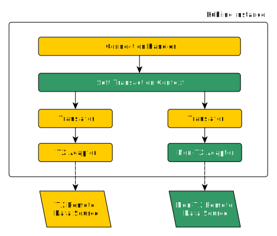
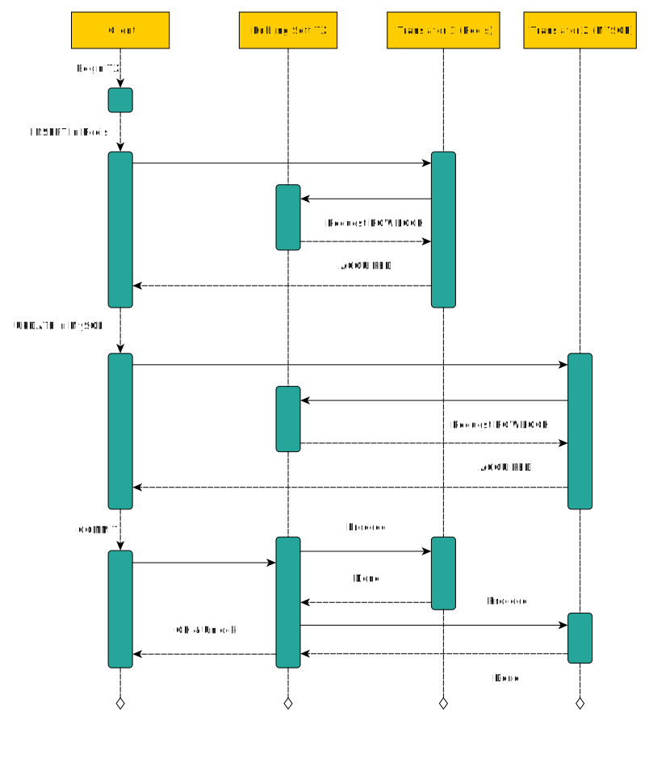

import { Callout } from 'nextra/components'
import Tag from '../../component/Tag'

# Transactions <Tag bgColor={"bg-kubling-dark-violet"} txtColor={"text-white"} description={"PREVIEW"} txtFont={"font-gilroyBold"} />

In Distributed Query Processing (DQP) engines like Kubling, transactions are essential for ensuring data consistency, reliability, 
and correctness when executing queries across multiple data sources or nodes in a distributed system. 
[As mentioned here](/Concepts/architecture#query-engine), DQP refers to the process of breaking down a query into multiple independent tasks, 
allowing parallel processing and eventual result aggregation.

Kubling supports both stateful and stateless data sources, which introduces challenges when managing transactions for stateless sources. 
This is particularly complex when a data source is implemented programmatically, as with [Script Document Data Sources](/Engine/ds/script-doc).

Data sources in Kubling can be broadly categorized into two main groups:

- **TX Data Sources**: These support native transactions, meaning they handle transaction management at the origin. Examples include MySQL and PostgreSQL.

- **Non-TX Data Sources**: These do not support transactions, like Redis, Cassandra, and most APIs.

This distinction can conflict with one of Kubling's core principles: the ability to federate heterogeneous data sources seamlessly, 
including within transactional contexts.

Starting from version `25.3`, Kubling addresses this by introducing connection-level transaction support, regardless of the underlying data source. 
However, this approach introduces some important considerations for developers and users, which are explained in the following sections.

---

## Why Transactions?

In an era where eventual consistency has become the default approach for many distributed systems, the importance of transactions is often downplayed or overlooked. 
However, transactions still play a critical role in maintaining data integrity, reliability, and operational simplicity, even in distributed environments. 

### The Problem with "Eventual Consistency Glue"

The rise of decentralized platform architectures plus distributed databases like Cassandra, MongoDB, and even data streaming platforms like Kafka, 
has pushed organizations towards eventual consistency. While this model provides scalability and availability, it comes at the cost of increased complexity 
and potential data anomalies.

Many organizations attempt to bridge this gap by writing glue code to manage these consistency problems. 
They often resort to compensating transactions, distributed locks, or even manual reconciliation processes, which can be error-prone, difficult to maintain, 
and a nightmare to debug in production.

### The Kubling Approach

With the introduction of Soft Transactions in version 25.3, Kubling aims to provide many of these benefits while still being compatible with distributed, 
non-transactional data sources like Cassandra, Redis, and APIs. This approach seeks to bridge the gap, offering a balance between the scalability 
of distributed systems and the data integrity guarantees of traditional databases, often requires in the operational space.

By introducing row-level locks, compensation mechanisms, and strict transaction boundaries, Kubling provides developers and AI Agents with a powerful tool for building robust, 
data-intensive applications without resorting to brittle glue code.

While this approach might not replace the need for distributed consistency patterns like event sourcing or CQRS in all cases, 
since from Kubling's standpoint, ensuring consistency is the responsibility of downstream data sources, it significantly simplifies the development 
and operational complexity of many common data use cases, without sacrificing the scalability benefits that modern systems demand.


---
# Architecture


The **Soft Transaction Context** (introduced in version `25.3`), which is associated with a connection (or session), coordinates all transactions, regardless of whether the underlying data source supports them or not.

This approach shifts transaction management from the translator itself to the **Soft Transaction Engine**, which operates at a higher layer within the system architecture.

Let's break down the sequence of a transaction operation in the following diagram:



## Row Locking

To enable transactions, the **Soft Transaction Engine** implements a row locking mechanism that assigns a globally unique identifier to each individual row. 

This leads to the first requirement when enabling soft transactions: **tables must have primary or unique keys**. Without these, Kubling cannot precisely identify the row involved in the operation, making it impossible to prevent other connections from accessing or modifying the same data concurrently.

#### How It Works

Each time a connection issues a CUD (Create, Update, Delete) command that is forwarded to the corresponding translator, the engine attempts to acquire a row lock before processing the command. If the lock cannot be obtained, the operation is rejected, and the client will receive an error, leaving it up to the client to decide how to proceed with the transaction.

#### Performance Considerations

Row locks are stored in a separate file, which can lead to significant I/O overhead and disk space consumption, especially in high-throughput scenarios with thousands of operations per second. Please refer to the configuration section for more details on tuning this behavior.

<Callout type="info">
  We are working on `mesh transaction` support, which will allow multiple Kubling instances forming a mesh to elect a leader responsible for managing row locking at the mesh level.
  Additionally, there will be "leader candidates" that maintain a synchronized copy of the locks and can be promoted to leader if needed, ensuring high availability and fault tolerance.
</Callout>

## Committing Changes

Before a connection sends a `COMMIT` command, the **Soft Transaction Engine** treats all data sources uniformly, without distinguishing between those that natively support transactions (TX) and those that do not (Non-TX). 

### Pre-Commit State

During this pre-commit phase, the engine only registers the operations in a cache and locks the corresponding rows, without directly interacting with the remote data sources. This approach keeps the transaction in a "soft" state, meaning it can be completely rolled back without affecting the underlying systems.

### Commit Process

When the `COMMIT` command is finally received, the **Soft Transaction Engine** coordinates the process as follows:

1. **TX Data Sources**  
   For data sources that support transactions (like PostgreSQL, MySQL, etc.), the engine simply pushes down the pending commands as a single transaction, allowing the underlying database to handle the commit atomically.

2. **Non-TX Data Sources**  
   For non-transactional data sources (like Redis, Cassandra, or most REST APIs), the engine executes the pending commands one by one, keeping track of compensation commands to ensure data consistency in case of rollback.

### Compensation Mechanism

Since non-TX data sources do not provide native rollback capabilities, the engine prepares "compensation" commands for each operation, which are the logical inverse of the original commands. This approach is essential for maintaining consistency in distributed transactions.

#### Examples

- **INSERT → DELETE**  
  If an `INSERT` command fails during commit, the engine will attempt to remove the inserted record to "compensate" for the failed transaction.

```sql
-- Original command
INSERT INTO inventory (product_id, name, stock) VALUES (101, 'Laptop', 50);

-- Compensation command
DELETE FROM inventory WHERE product_id = 101;
```

- **UPDATE → Compensating UPDATE**  
  If an `UPDATE` fails, the engine can revert the record to its previous state.

```sql
-- Original command, current stock = 50
UPDATE inventory SET stock = 40 WHERE product_id = 101;

-- Compensation command
UPDATE inventory SET stock = 50 WHERE product_id = 101;
```

- **UPDATE → Compensating UPDATE**  
  If a `DELETE` operation is part of the failed transaction, the engine re-inserts the deleted record to restore the original state.

```sql
-- Original command
DELETE FROM inventory WHERE product_id = 101;

-- Compensation command
INSERT INTO inventory (product_id, name, stock) VALUES (101, 'Laptop', 50);
```

### Rolling Back

If any participant (translator) reports an error during the commit phase, the Soft Transaction Engine initiates a rollback by executing the 
prepared compensation commands for each non-TX data source involved in the transaction. This ensures a consistent state across all data sources, 
regardless of their native transaction support.


### Understanding Kubling's Soft Transaction Model

  Kubling's Soft Transaction Engine, while powerful, differs significantly from traditional database transaction models. Here are a few critical considerations:

  - **Read Consistency**: 
    Unlike traditional databases with strict isolation levels (e.g., READ COMMITTED or SERIALIZABLE), Kubling's Soft Transaction Engine does not guarantee consistent reads within a transaction.
    That is, if a row is read either inside or outside of a transaction, the changes performed within a transaction are not visible until the transaction is committed.
    This means you might see "dirty reads" or non-repeatable reads if the same row is accessed concurrently from different connections.

  - **Phantom Records**:
    If an `UPDATE` or `DELETE` statement targets rows that do not yet exist but match the criteria of the operation, and another connection subsequently inserts a matching row before the transaction commits,
    the newly added row **will** be affected by the operation when the transaction is committed.
    This happens because the Soft Transaction Engine does not lock ranges but individual rows, meaning it cannot prevent the insertion of matching rows by other connections.

  - **No Range Locks**:
    Unlike some traditional database engines that use range locking to prevent phantom reads, Kubling's engine relies on row-level locks only.
    This approach is more lightweight and scalable but comes at the cost of allowing potentially conflicting operations to interleave.

  - **No MVCC (Multiversion Concurrency Control)**:
    Kubling does not maintain historical versions of a row, meaning it cannot provide true snapshot isolation. This makes the transaction model closer to optimistic concurrency,
    where conflicts are only detected and resolved at commit time, not at read time.

These trade-offs make Kubling's Soft Transaction Engine suitable for high-throughput, distributed operational environments where absolute consistency is challenging to achieve, especially when integrating with non-transactional data sources. 
These systems lack built-in mechanisms for multiversion concurrency control (MVCC) and strict transactional isolation, which means the Soft Transaction Engine must rely on row locking and compensating operations to approximate ACID behavior. 

However, this approach comes with inherent limitations:

- **Phantom Reads**: The Soft Transaction Engine can prevent direct write conflicts but cannot fully prevent phantom reads, as it lacks a global view of all potential data changes.
- **Write Skew and Lost Updates**: Without true MVCC, concurrent operations on overlapping rows may lead to unexpected data states.
- **Partition Tolerance Overhead**: The need to coordinate locks and compensations across distributed systems can increase the risk of performance bottlenecks.

**As a result, it is crucial to carefully design your data models and transaction boundaries to minimize the impact of these limitations.**

### Configuration
Soft transactions must first be enabled at the instance level via the [application configuration](/schemas#main-application-configuration).  
Then, each individual data source can be marked as eligible to participate in a transaction. Please refer to each data source's configuration specification for details.

#### Row Lock Database
By default, the row lock database is created at `[WORKDIR]/kubling-stx.db`. However, it is recommended to mount a separate volume for this database using the `softTransactions.transactionsDBPath` property.  
Keep in mind that the underlying storage system must provide sufficient I/O performance and space to handle potentially high transaction operation bursts.

**Lock Cleanup and File Shrinking**  
Since the locks database is designed for high throughput, row unlocks and deletions do not immediately free up space on disk, as this would be too resource-intensive and could slow down the locking mechanism.  
Instead, a separate background task is responsible for periodically cleaning up the lock database and shrinking the file, a process known as "flush removal" in Kubling.  
By default, this task runs every 5 minutes and is allowed to "disturb" the performance for up to 2 seconds.

**Tuning the Flush Removal Task**  
You can adjust the frequency of this cleanup task using the `softTransactions.flushRemovalTaskCron` property, depending on your storage constraints and transaction patterns:

- **High Capacity Volumes (5GB+), Small Transactions (up to 10-15 operations)**  
  Run the cleanup task every hour to reduce I/O impact.

- **High Capacity Volumes (5GB+), Large Transactions (more than 100 operations)**  
  Run the cleanup task every 10-15 minutes to prevent the lock database from growing too large.

- **Low Capacity Volumes (~500MB or less)**  
  Run the cleanup task every 5 minutes to prevent the lock database from consuming all available space.


## Transaction support in Actions

Actions leverage a pool of internal connections (sessions) within Kubling to execute queries, treating each query—referred to as an Operation—as an atomic transaction. 
This design means that a group of Operations cannot be part of a session-level transaction. 
This decision was made deliberately, recognizing that most use cases rely heavily on the `waitUntilEffective` attribute for the majority of their operations, 
which inherently precludes the possibility of rolling back a transaction.

Consequently, in the event of an error, Actions utilize a compensation mechanism instead of traditional rollback.
For more details, please refer to the [Actions documentation](/Engine/endpoints#dealing-with-errors).