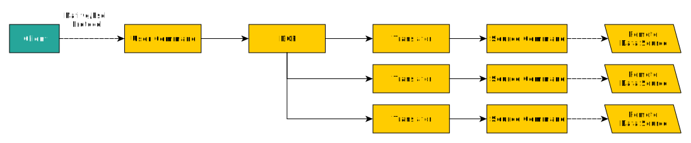

import { Callout } from 'nextra/components'
import Tag from '../../component/Tag'

# Tracing

Having traces in database engines is not always revealing, unless queries are distributed. In those cases, understanding how the query processor handled each step becomes critical.

Kubling is not a distributed system in the traditional sense, as it builds *federations* rather than *clusters* (at least regarding query execution).  
However, the Distributed Query Processor (DQP) behaves as an internal distributed engine, [as explained here](/concepts/architecture#query-engine).

This is a key concept to understand how Kubling emits tracing information and what you can do with it.

The general flow of a `command` (from the client to the remote data origins) looks like this for a query that involves three data sources:



In this flow, two points are particularly interesting:

- **User Command**: the SQL command received from the client.
- **Source Commands**: the transformed commands generated by the DQP to retrieve the required data from each remote data source.

That distinction is crucial: what the DQP requests from each source is not a copy of the user command, but a rewritten fragment based on the query plan.

So, one of the most valuable insights you can extract from traces is the correlation between:
- a **Source Command** (a query to a remote data source), and  
- the **original User Command** that triggered it.

This correlation allows you to track performance, latency, and errors across the entire lifecycle of a federated query—from client to source and back.

## Configuration

<details>
<summary>Tracing configuration section</summary>
```yaml
tracing:
  type: "object"
  id: "schema:kubling:dbvirt:config:app:instrumentation:TracingProperties"
  properties:
    scheduleDelayInSeconds:
      type: "integer"
      description: "The delay interval (in seconds) between each batch export\
        \ operation. Controls how frequently accumulated telemetry data is flushed\
        \ to the exporter. Default: 5 seconds."
    maxExportBatchSize:
      type: "integer"
      description: "The maximum number of telemetry items (spans, logs, etc.)\
        \ included in a single export batch. Larger batches improve throughput\
        \ but may increase export latency. Default: 512."
    maxQueueSize:
      type: "integer"
      description: "The maximum number of telemetry records that can be queued\
        \ for export. If the queue reaches its capacity, new records may be\
        \ dropped. Default: 512."
    exporterTimeoutInSeconds:
      type: "integer"
      description: "The maximum time (in seconds) allowed for a single export\
        \ attempt. If the exporter does not complete within this timeout, the\
        \ batch is considered failed. Default: 6 seconds."
    enabled:
      type: "boolean"
    url:
      type: "string"
    headers:
      type: "object"
      additionalProperties:
        type: "string"
    includeQueryPlan:
      type: "boolean"
    includeFullCommand:
      type: "boolean"
    includeRequestIdSpanAttribute:
      type: "boolean"
    sampling:
      type: "number"
      description: "The sampling ratio applied to telemetry data. A value of\
        \ 1.0 means all telemetry is sampled; lower values reduce the volume\
        \ by randomly selecting a fraction of events. Default: 1.0 (always sample)."
```
</details>

Example
```yaml
tracing:
  enabled: true
  includeQueryPlan: false
  includeFullCommand: false
  includeRequestIdSpanAttribute: true
  scheduleDelayInSeconds: 5
  maxExportBatchSize: 512
  maxQueueSize: 512
  exporterTimeoutInSeconds: 6
  url: "http://127.0.0.1:4318/v1/traces"
  headers:
    some: "header"
  sampling: 1
```

## User Command (`USER COMMAND`)

This span represents the command received from the client. It includes the following attributes:

| Attribute            | Type   | Description                                                                                | Example                           |
|----------------------|--------|--------------------------------------------------------------------------------------------|-----------------------------------|
| `db.system`          | string | Identifies the database system. Useful for filtering when multiple engines emit telemetry. | `"kubling"`                       |
| `db.name`            | string | Name of the Virtual Database (VDB) the command targets.                                    | `"dcim"`                          |
| `db.user`            | string | User principal that initiated the command.                                                 | `"admin"`                         |
| `db.operation`       | string | Type of operation performed.                                                               | `"SELECT"`, `"INSERT"`, etc.      |
| `component`          | string | Kubling module responsible for emitting the span.                                          | `"dqp"`                           |
| `kubling.session.id` | string | Internal session identifier.                                                               | `"sess-01FX...8KD"`               |
| `kubling.request.id` | string | Internal request identifier. Only present if `includeRequestIdSpanAttribute` is enabled.   | `"abcd..."`                       |
| `db.command`         | string | Full SQL command issued by the client. Only included if `includeFullCommand` is enabled.   | `"SELECT * FROM metrics LIMIT 5"` |

### `query.plan.complete` event

When `includeQueryPlan` is set to `false`, the DQP emits an event with just the name, allowing you to measure how long it took to determine the execution plan.

However, when a valid plan is available and `includeQueryPlan` is set to `true`, the event includes an additional `detail` attribute containing the full plan in YAML format.

<Callout type="warning">
  Avoid enabling `includeQueryPlan` in production environments. Query plans can grow significantly in size depending on the complexity of the command.
  This can lead to increased resource usage and potential performance degradation.
  Additionally, if you're using a paid observability platform that charges based on storage, enabling this option may result in unexpected costs. Use it only in development or debugging scenarios.
</Callout>

### `query.cancel` event

This event is added when the DQP receives a cancellation request from the client.  
It marks the point in time when the engine stops processing the command as requested by the user.

### `query.error` event

This event is added when the DQP detects an error during query execution and marks the command as failed.

## Source Command (`SRC COMMAND`)

This span represents events that occur within a source (translator) during query execution.

| Attribute            | Type    | Description                                                                                                                                                                  | Example                                          |
|----------------------|---------|------------------------------------------------------------------------------------------------------------------------------------------------------------------------------|--------------------------------------------------|
| `db.system`          | string  | Identifies the database system. Useful for filtering when multiple engines emit telemetry.                                                                                   | `"kubling"`                                      |
| `db.operation`       | string  | Type of operation being executed.                                                                                                                                            | `"SELECT"`, `"INSERT"`, etc.                     |
| `component`          | string  | Indicates the translator type, which corresponds to the `dataSourceType` as [defined here](/schemas#virtual-database-information-file-located-inside-the-descriptor-bundle). | `"KUBERNETES"`, `"MODBUS"`,  `"CASSANDRA"`, etc. |
| `kubling.translator` | boolean | A marker attribute that identifies the span as part of a translator (source command). Useful for filtering.                                                                  | `true`                                           |
| `kubling.session.id` | string  | Internal session identifier.                                                                                                                                                 | `"sess-01FX...8KD"`                              |
| `kubling.source.id`  | string  | Internal source command identifier. Only included if `includeRequestIdSpanAttribute` is enabled.                                                                             | `"abcd..."`                                      |
| `db.command`         | string  | Full SQL command issued by the client. Only included if `includeFullCommand` is enabled.                                                                                     | `"SELECT * FROM metrics LIMIT 5"`                |

### `source.command` event

Represents the full SQL command **executed against the remote data source**.  
This event is only present when `includeFullCommand` is enabled.

<Callout type="info">
  This event is only meaningful for Database Data Sources (e.g., MySQL, PostgreSQL).  
  For other sources like Redis, Cassandra, Kubernetes, or REST APIs, there is no SQL translation in the strict sense.  
  For more details, see [this section](/engine/ds/intro).
</Callout>

### `query.cancel` event

Added when the DQP receives a cancellation signal for the source command.  
It marks the point where execution in the translator was stopped.

### `query.error` event

Added when an error occurs **within a specific translator** during execution.  
This allows pinpointing which source failed in a multi-source query.
