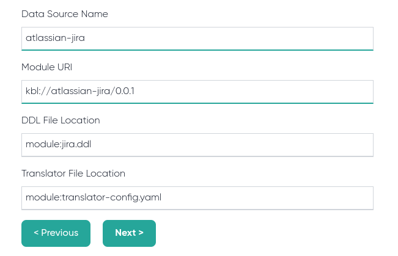

import { Callout } from 'nextra/components'

# Console

The embedded console allows you to quickly configure and test data sources.

<Callout type="warning">
  In production environments, it is not recommended to enable console, since Kubling is designed with instance immutability in mind.
</Callout>

## Add a new JavaScript Module

By default, the engine uses the [official repository](https://repo.kubling.com/api/v1/query) to get JavaScript module bundles.

Modules published in the offical repository are open source and can be found at [Kubling GitHub org](https://github.com/orgs/kubling-community/repositories) (PRs are welcome!) 

### Configuration

After selecting the Module and version, you will be able to specify some basic configuration, as follows:

#### Data Source Name

The name of the `Schema` in the DB.

#### Module URI

The `URI` used by the engine to resolve the module. The URI scheme `kbl` resolves to the official module repository.

#### DDL file location

Indicates from where to load the DDL. `module` indicates to the engine that the file URI must be resolved inside the module zip file.

#### Translator file location

Indicates from where to load the translator configuration file, using same mechanism as in DDL file.

### Variables

Each module lists required variables, which must be introduced in this step.

## Add a new Kubernetes Cluster

To add a new Kubernetes Cluster as Data Source, you need to obtain its configuration file. 
Default locations are: Linux & Mac `~/.kube/config`, Windows `%USERPROFILE%\.kube\config`

There is a default DDL proposed by the engine that you can adapt to your needs. Be sure you understand how it works before changing it 
since DDL files are loaded during engine bootstrap and it fails if an error is enconutered in any of them.

## Deploy

Once finished adding Data Sources, the new descriptor configuration is saved in the engine but not yet loaded.
Click on `Deploy` button to finish the process.

## Verify

In the sidebar, click on `Engine Metadata` to verify whether new Data Sources were successfuly added.

<Callout>
  When the service instance is stopped, the configuration you added via console is lost. To make it permanent, please create a descriptor bundle 
  as [explained here](../Modules/descriptor).
</Callout>